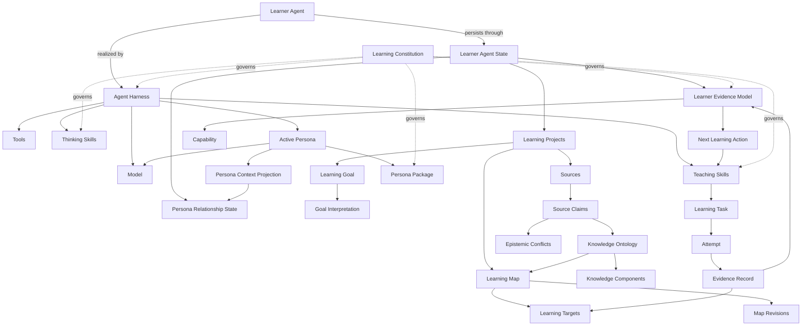

# Socratink Learner Agent OS

Socratink provides each learner with a durable agent that maintains continuity while learning goals, subjects, models, skills, and personas change.

## Language

**Learner Agent**:
The learner-facing product identity, realized at runtime by composing Learner Agent State with an Agent Harness, Model, and Tools. One Learner Agent may encompass multiple specialized learning contexts without fragmenting canonical learner evidence.
_Avoid_: AI tutor, chatbot, separate subject agent

**Learner Agent State**:
The durable, learner-owned record that carries identity, ontology, evidence, permissions, policies, and installed skill and persona manifests across model changes. It is the persistence boundary of the Learner Agent.
_Avoid_: Chat history, model memory, profile

**Agent Harness**:
The replaceable runtime that interprets Learner Agent State and coordinates Models, Tools, Thinking Skills, Teaching Skills, and Persona Packages.
_Avoid_: Learner Agent, agent identity

**Model**:
A replaceable inference engine used by the Agent Harness. It does not own learner identity, evidence, or continuity.
_Avoid_: Learner Agent, source of truth

**Tool**:
A capability invoked by the Agent Harness to observe or change something outside model inference. A Tool does not become learner evidence merely because the Learner Agent invoked it.

**Knowledge Ontology**:
The Learner Agent's evolving semantic structure of claims, concepts, capabilities, relationships, sources, provenance, and uncertainty. It represents available knowledge structure, not what the learner has demonstrated.
_Avoid_: Mastery graph, learner profile, vector index

**Learning Map**:
A goal-scoped, versioned route through the Knowledge Ontology, organized around demonstrable Learning Targets. It proposes what to target and how targets relate without claiming that the learner has mastered them. Adding or changing a Source produces a proposed Map Revision rather than silently rewriting the active map.
_Avoid_: Knowledge Ontology, mastery map, curriculum progress bar

**Map Revision**:
An inspectable proposal to change a Learning Map, showing added, removed, or changed targets and relationships together with conflicts, provenance, and rationale. Material changes require learner confirmation before the revision becomes active; prior versions and their evidence links remain preserved.
_Avoid_: Silent reindexing, mutable map overwrite

**Learner Evidence Model**:
The evidence-backed account of what the learner attempted or demonstrated, linked to Learning Targets while remaining separate from the Knowledge Ontology. It may express uncertainty but never converts inference, exposure, or model agreement into learner evidence.
_Avoid_: Knowledge Ontology, mastery score, chat memory

**Learning Target**:
A goal-scoped, evidence-evaluable claim that the learner can perform a stated action under stated conditions. It is the universal routable unit of a Learning Map and never stores mastery as a fact.
_Avoid_: Topic, concept node, mastery node, completion item

**Knowledge Component**:
A concept, rule, relationship, or skill hypothesized to support one or more Learning Targets. It belongs to the Knowledge Ontology and is not itself evidence of learner capability.
_Avoid_: Learning Target, mastery state

**Learning Task**:
An activity designed to elicit observable work relevant to one or more Learning Targets. Completing a Learning Task does not by itself establish a learner claim.
_Avoid_: Content item, completion event

**Attempt**:
The learner's preserved response to a Learning Task under recorded conditions, including assistance, modality, timing, and relevant context. An Attempt is an observation, not a conclusion about the learner.
_Avoid_: Answer, score, mastery event

**Evidence Record**:
An Attempt together with its conditions, provenance, and bounded interpretation against one or more Learning Targets. It may support, weaken, or leave a learner claim unresolved.
_Avoid_: Mastery label, model opinion

**Capability**:
A higher-order durable claim supported by evidence across multiple Learning Targets, tasks, contexts, or times. A single Attempt cannot establish a Capability.
_Avoid_: Learning Target, topic, one-shot mastery

**Thinking Skill**:
A versioned reasoning procedure the Learner Agent invokes to analyze, frame, investigate, or decide. Its output is agent reasoning and does not become learner evidence.
_Avoid_: Teaching Skill, learner capability

**Teaching Skill**:
A governed instructional procedure that creates or selects a Learning Task, observes an Attempt, and may produce an Evidence Record under an explicit evidence contract.
_Avoid_: Thinking Skill, lesson content, persona

**Persona Package**:
A reusable, versioned specification of mental models, heuristics, voice, interaction protocols, disclosures, and constraints. It is mostly immutable and shapes Skill execution without owning learner memory or overriding evidence and safety contracts.
_Avoid_: Learner Agent, Teaching Skill, learner memory, source of truth

**Persona Relationship State**:
The learner-specific history, preferences, trust boundaries, and established interaction conventions associated with one Persona Package. It belongs to Learner Agent State and never becomes shared package content.
_Avoid_: Persona Package, chat transcript, canonical learner evidence

**Persona Context Projection**:
The smallest relevant, inspectable subset of Persona Relationship State assembled for the model's current context. It is working context rather than durable memory.
_Avoid_: Persona Relationship State, full relationship history

**Active Persona**:
The runtime costume produced by composing a Persona Package, Persona Context Projection, current interaction context, constitutional constraints, and a Model. It is not a separately persistent Learner Agent.
_Avoid_: Persona Package, separate agent, simulated person

**Next Learning Action**:
The single recommended learner-facing cognitive action, tied to a Learning Target and Teaching Skill and accompanied by its modality, rationale, expected evidence, and override path. An override changes the route without changing historical evidence.
_Avoid_: Agent Action, task queue, engagement prompt

**Agent Action**:
Research, retrieval, transformation, tool use, scheduling, planning, or other work performed by the Learner Agent. An Agent Action does not become learner evidence.
_Avoid_: Next Learning Action, learner attempt

**Learning Goal**:
A learner-owned desired outcome or performance demand that scopes a Learning Map. The Learner Agent may propose a sharper interpretation, but the learner retains final authority over the goal and every material reinterpretation.
_Avoid_: Learning Target, agent objective, engagement goal

**Goal Interpretation**:
The Learner Agent's explicit, learner-confirmed formulation of what a Learning Goal currently means. Changing it versions the Learning Map without rewriting Sources, Attempts, or prior Evidence Records.
_Avoid_: Silent inference, replacement goal

**Learning Constitution**:
The global, versioned product contract governing epistemic honesty, provenance, learner agency, evidence standards, assistance disclosure, safety, and the separation of empirical findings, philosophical commitments, and product hypotheses. Models, Tools, Skills, and Persona Packages cannot override it. Learners may inspect it and choose stricter preferences, but cannot weaken its core protections. Every change requires explicit governance, rationale, versioning, and migration treatment.
_Avoid_: Persona policy, learner preference, hidden system prompt

**Learning Project**:
A learner-owned container for one coherent learning endeavor, joining a Learning Goal, authorized Sources, constraints, a Learning Map, and relevant views into the shared Learner Evidence Model. A Source may initiate the project, and the learner may authorize additional Sources that inform later versions of its map and structure. One Learner Agent may maintain many Learning Projects without partitioning canonical learner evidence.
_Avoid_: Separate subject agent, course folder, isolated mastery profile

**Source**:
A learner-authorized, versioned artifact or external reference used to ground a Learning Project. Its original content remains immutable. Extracted claims, chunks, embeddings, summaries, generated explanations, and other transformations are derivatives with explicit provenance, never silent replacements for or promotions into the Source. Detailed ingestion and storage architecture is governed separately.
_Avoid_: Chunk, embedding, generated explanation, unversioned mutable document

**Source Claim**:
An addressable interpretation of what a Source asserts, preserving its exact provenance, scope, extraction method, and confidence. Source Claims from different Sources remain distinct even when they appear equivalent.
_Avoid_: Unattributed fact, generated summary, canonical truth

**Epistemic Conflict**:
An explicit relationship between Source Claims that disagree or cannot yet be reconciled within their recorded scopes. The Learner Agent may explain or evaluate the conflict but cannot erase it through silent synthesis or false certainty.
_Avoid_: Data error, majority vote, forced consensus

## Canonical relationships

The Knowledge Ontology represents knowledge structure. The Learner Evidence Model represents bounded claims about learner performance. The Learning Map connects them operationally without collapsing either into a mastery graph. Models, Tools, Skills, and personas may change how the Learner Agent acts, but they do not own identity, rewrite provenance, or manufacture learner evidence.
