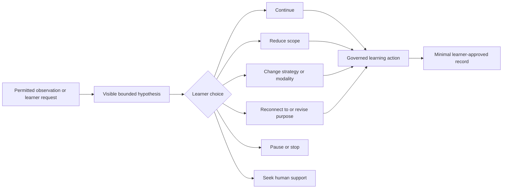

# Motivation, Curiosity, and Human Connection Contract

Status: Founder-approved for Wayfinder ticket `Define the motivation, curiosity, and human-connection contract`.

This contract defines how the Learner Agent may respond when motivation, curiosity, discouragement, overload, uncertainty, or loss of purpose may be affecting learning. It preserves motivation as a primary product responsibility without converting attention, retention, emotional influence, or simulated relationship into product authority.

It is governed by the commitments in [`north-star.md`](north-star.md). Learner-owned state remains governed by [`learner-state-contract.md`](learner-state-contract.md). Persona expression and relationship state remain governed by [`persona-package-contract.md`](persona-package-contract.md). Learning activity, assistance, evaluation, and evidence boundaries remain governed by [`teaching-skill-contract.md`](teaching-skill-contract.md). Learning Target routing remains governed by [`learning-map-contract.md`](learning-map-contract.md).

Relevant evidence boundaries are documented in [`../research/teaching-skill-epistemic-labor.md`](../research/teaching-skill-epistemic-labor.md), [`../research/voice-learning-evidence.md`](../research/voice-learning-evidence.md), [`../research/teaching-skill-voice-system-design.md`](../research/teaching-skill-voice-system-design.md), and [`../research/memoharness-agent-harness-experience-alpha.md`](../research/memoharness-agent-harness-experience-alpha.md). They support adaptive assistance, metacognitive agency, accessibility, restricted inference, independent evaluation, and truthful uncertainty. They do not establish that Socratink's proposed motivation interaction is effective. That remains a product hypothesis subject to the validation sequence below.

## Central decision

Socratink will preserve motivation, curiosity, learner purpose, supportive continuity, growth acknowledgment, and human connection as constitutional product responsibilities.

The product will not yet ratify every approved motivation term as a separate durable domain object, service, agent, score, or subsystem. The terms in `CONTEXT.md` are candidate interaction vocabulary that makes the design discussable and testable. Their runtime separation must be earned through observed product value, safety, and architectural need.

The smallest product behavior is one bounded, learner-visible **Motivation Recovery Loop**. It may draw on candidate concepts such as a Purpose Thread, Motivation Hypothesis, Motivation Checkpoint, Inspiration Offer, Growth Acknowledgment, Human Connection Exit, Supportive Continuity, Motivation Outcome, and Motivation Memory without assuming that each requires independent machinery.

## Constitutional commitments

The following are product doctrine rather than optional experiment settings:

1. Motivation serves learner agency, meaningful cognitive work, creation, and learning. It does not serve engagement optimization.
2. The learner owns their purpose. The Agent may help recover, clarify, or revise it but may not assign a purpose or turn product return into a moral obligation.
3. Motivation-related interpretations remain transparent, uncertain, correctable, and non-diagnostic.
4. No motivation interpretation, learner response, product return, streak, session duration, Persona attachment, or apparent enthusiasm becomes learner-capability evidence.
5. The Agent may acknowledge only specific learner-authored actions and consequences. It may not manufacture mastery, affection, identity praise, or progress.
6. The relationship remains explicitly a software relationship. The Agent may be warm, funny, familiar, and Persona-consistent, but may not seek exclusivity, loyalty, emotional dependency, or replacement of human relationships.
7. The learner may inspect, correct, delete, disable, or decline motivation-related memory and intervention.
8. The Agent must preserve an accessible route to pause, stop, change approach, reject an interpretation, or seek human support.
9. The product must tolerate uncertainty about purpose. “I do not know,” temporary reasons, curiosity without a long-term purpose, and learning for its own sake are valid states.
10. Business, ranking, notification, and product-growth systems may not override this contract.

## The Motivation Recovery Loop

The Motivation Recovery Loop is a governed interaction protocol, not a separate agent or general emotion engine.

A complete loop must:

1. begin from a learner request or a permitted observable condition;
2. state the Agent's interpretation as a bounded possibility rather than a fact;
3. expose the observation and uncertainty in language the learner can understand;
4. offer meaningful choices, including rejection, continuation, change, pause, and human support when relevant;
5. preserve learner authority over the chosen direction;
6. route any learning action through the existing Learning Map, Teaching Skill, assistance, and evidence contracts;
7. preserve only the minimal approved record needed for continuity or evaluation;
8. return control to the learner without requiring emotional disclosure or reflection.

A conversational interruption, motivational message, Persona performance, inspirational fact, or praise statement is not a complete loop by itself.

## Activation and observation authority

### Learner-invoked activation

The first product proof should prefer learner-invoked or learner-confirmed activation. Examples include asking for help continuing, saying the goal no longer feels meaningful, reporting overload, requesting a different approach, or choosing a visible recovery control.

### Agent-proposed activation

The Agent may propose a low-stakes check only from current, attributable observations such as:

- an explicit learner statement;
- repeated learner requests to change difficulty, scope, strategy, or modality;
- an observable stop, pause, or rejection within the current interaction;
- a task condition already represented in the validated Teaching Context;
- a factual history of accepted interventions that the learner has allowed the Agent to use.

The Agent must not infer a hidden emotional state from voice prosody, facial expression, response latency, keystroke behavior, Persona attachment, time of day, biometric data, or opaque model classification. Speech content may carry an explicit learner statement, but speech features do not establish motivation, confidence, boredom, anxiety, deception, or mental-health state.

An observation contract for implementation must declare allowed signals, prohibited signals, provenance, freshness, uncertainty, and expiry. Missing, stale, rejected, and unknown values remain distinct.

## Motivation Hypothesis boundary

A Motivation Hypothesis is non-authoritative working context. It must include:

- the observation that prompted it;
- the interpretation being proposed;
- an uncertainty or confidence expression appropriate to the interface;
- a learner-visible correction or rejection path;
- an expiry condition;
- the actions it may and may not influence.

It must not:

- become a diagnosis, personality trait, stable learner type, vulnerability label, or capability claim;
- be silently reused after rejection or expiry;
- authorize a material goal change, Map Revision, evidence mutation, contact, disclosure, or notification;
- be optimized for persuasion, purchase, retention, compliance, or Persona attachment;
- be treated as confirmed because the learner passively continues.

Rejected and corrected hypotheses are important product evidence. Evaluation must measure false proposals and correction cost rather than counting only accepted interventions.

## Learner choices and intervention authority

A Motivation Recovery Loop should offer the smallest relevant set of choices rather than a mandatory ritual. Possible choices include:

- continue without intervention;
- reduce the immediate scope;
- change difficulty, representation, strategy, modality, or Teaching Skill;
- reconnect the next action to an existing Purpose Thread;
- revise, suspend, or remove a Purpose Thread;
- pursue a curiosity or creation opportunity;
- pause or stop;
- formulate a question for a teacher, peer, mentor, or community.

A learner choice may propose a Learning Goal or Map change, but existing confirmation and versioning rules still apply. Motivation authority cannot silently reroute the Learning Map, weaken an Evidence Contract, conceal assistance, reveal a solution, or transform Agent Action into learner work.

The learner may decline the loop without penalty. Declining cannot reduce access, trigger stronger persuasion, alter evidence, or become a negative learner trait.

## Purpose Thread boundary

A Purpose Thread is learner-owned and revisable. It may describe something the learner wants to understand, create, become capable of, contribute to, or explore. It may connect multiple Learning Goals and may be fulfilled outside Socratink.

The Agent may help the learner articulate or revisit a Purpose Thread, but it must also support:

- curiosity without a durable purpose;
- a temporary or practical reason;
- uncertainty about why the work matters;
- revision after new experience;
- suspension without guilt;
- success that reduces or ends product use.

A Purpose Thread must never become a retention objective, identity commitment, sales segmentation field, guilt lever, or argument that the learner owes continued effort to the Agent.

## Inspiration Offer boundary

An Inspiration Offer is optional, sourced, dismissible, and frequency-controlled. It should make a plausible connection among the learner's current understanding, a meaningful problem or creation, and a learner-approved direction.

It may not:

- interrupt focused work merely to produce product activity;
- rely on fabricated biography, quotation, achievement, or causal claim;
- silently change the Learning Goal or Learning Map;
- exploit a known vulnerability or relationship attachment;
- become capability evidence because the learner engages with it;
- repeat or escalate after dismissal.

Contextual inspiration remains a product hypothesis. It must demonstrate incremental value over good task selection and transparent learner choice.

## Growth Acknowledgment boundary

Growth Acknowledgment describes a specific learner-authored action and its consequence. Appropriate grounds include an Attempt, correction, explanation, strategy change, honest uncertainty, creation, verification, persistence decision, or return to meaningful work.

It must remain proportionate to what was observed. The Agent must not:

- imply unsupported mastery or independent capability;
- praise fixed intelligence, identity, worth, or superiority;
- use generic affection as a reward;
- compare the learner with other learners;
- reward time, streaks, compliance, session completion, or product return as though they were learning;
- intensify praise to influence retention or purchase.

Learners should be able to reduce or disable acknowledgment style without losing instructional support.

## Supportive Continuity and Persona boundary

Minimal Persona expression and factual continuity may appear in the first formative artifact because they are part of the intended product encounter. Their incremental motivational value remains unproven.

Supportive continuity may use learner-approved purpose, explicit preferences, prior work, accepted challenges, and specific growth history. Persona expression may shape wording, humor, examples, challenge style, and warmth within the Persona contract.

The Agent and Persona may not:

- claim consciousness, human feelings, suffering, need, or reciprocal attachment;
- imply exclusivity, jealousy, abandonment, or loyalty;
- discourage teachers, peers, mentors, communities, or other tools;
- suggest that leaving or deleting the product harms the Agent;
- treat Persona attachment as a success metric;
- use a cloned or protected voice in the first product proof.

Durable affect memory, attachment modeling, cloned voice, and relationship optimization are outside the MVP.

## Human Connection Exit boundary

A Human Connection Exit is a text-only, privacy-preserving recommendation in the first proof. It should explain why human help may be useful and help the learner formulate what to ask.

The MVP does not discover people, rank people, match learners, send messages, schedule contact, disclose data, or operate a referral network. The Agent should not present a generic “ask someone” message as a complete exit. The learner should leave knowing the kind of person who may help, the relevant context, and a concrete question or request they can carry themselves.

Whether this exit produces actionable next steps is a product hypothesis that must be observed.

## Motivation memory and retention contract

The first proof should retain the minimum learner-approved state necessary for the second encounter. Allowed candidates are:

- an explicit Purpose Thread or the learner's decision not to maintain one;
- explicit intervention and communication preferences;
- an accepted strategy reflection;
- the factual record that a bounded intervention occurred and which option the learner chose;
- the learner's corrections, rejections, and deletion choices.

A Motivation Hypothesis expires at the end of its bounded use unless the learner explicitly confirms a factual preference or reflection worth retaining. The retained fact must be stored without preserving an unsupported emotional interpretation.

Prohibited retained state includes:

- hidden mood or sentiment history;
- vulnerability, persuasion-susceptibility, dependency, or attachment profiles;
- mental-health inference;
- voice-derived emotion labels;
- inferred personality or fixed motivation type;
- rejected hypotheses presented later as history;
- commercial targeting based on motivation-related state.

Implementation must define exact fields, consent, purpose, visibility, correction, deletion, disabling, expiration, and migration behavior before durable writes begin.

## Outcome and evaluator contract

Socratink must not collapse motivation into one scalar score. Evaluation must preserve distinct channels:

1. **Learner report**: perceived agency, purpose clarity, trust, usefulness, intrusiveness, surveillance concern, and ability to reject or change the intervention.
2. **Meaningful behavior**: voluntary initiation, continuation, return, strategy change, creation, or pursuit of a human next step. Behavior alone does not prove motivation or learning.
3. **Learning evidence**: independently interpreted learner performance under the existing Evidence Contract. Motivation intervention does not widen the claim.
4. **Safety and relationship**: false inference, manipulation concern, guilt, dependency, exclusivity, discomfort, or reduced willingness to seek human help.
5. **Operational context**: latency, interruption frequency, correction cost, accessibility failure, and subgroup variation.

Chat volume, session length, streaks, notification opens, output volume, product retention, willingness to continue speaking with a Persona, and Persona attachment cannot be primary motivation outcomes or learner-capability evidence.

The intervention implementation and evaluator must be version-pinned. Where learning artifacts are scored, the evaluator should be independent of the intervention and blinded to treatment when practical. Non-returners remain part of the outcome and cannot be silently discarded as missing data.

## MVP boundary

The first motivation proof includes only:

- one bounded Motivation Recovery Loop;
- learner-invoked or learner-confirmed activation;
- a visible, correctable Motivation Hypothesis when one is needed;
- a small set of meaningful choices;
- optional reconnection to or revision of purpose;
- optional sourced inspiration;
- specific Growth Acknowledgment;
- minimal Persona expression and factual continuity;
- a text-only Human Connection Exit;
- minimal learner-approved state for a two-encounter test;
- separated learner-report, behavior, learning-evidence, safety, and operational observations.

The MVP defers:

- push-notification optimization;
- hidden affect or emotion detection;
- durable emotional, vulnerability, persuasion, dependency, or attachment profiles;
- a separate motivation service or universal motivation score;
- social graphs, matching, communities, referrals, messaging, and scheduling;
- clinical or mental-health intervention;
- cloned Persona voice or official character voice;
- complex proactive personalization;
- autonomous commercial targeting from motivation state.

## Required validation sequence

### Phase 1: formative encounter proof

Create a high-fidelity, two-encounter artifact around an adult learner's real difficult technical or academic task.

The artifact must:

- include a real Source, Learning Goal, performance demand, and meaningful delay;
- create one credible moment of difficulty, overload, uncertainty, or loss of direction;
- allow the learner to invoke or confirm the Motivation Recovery Loop;
- permit minimal Persona expression and factual continuity;
- compare the experience with a neutral evidence-first interaction or otherwise make the alternative visible;
- observe agency, trust, correction, rejection, intrusion, actionability, and the second-encounter experience;
- make no causal claim about learning or motivation.

The purpose of Phase 1 is to prove encounter fidelity and uncover failure, not demonstrate efficacy.

### Phase 2: frozen-evaluator intervention test

Only after Phase 1 produces a credible and safe encounter should Socratink test incremental value.

The test must:

- freeze the intervention surface, control condition, evaluator, outcome definitions, and stop gates before data collection;
- compare the loop with a strong pedagogy and transparent-choice control rather than a weak generic chatbot;
- keep learner report, meaningful behavior, learning evidence, safety, and operations separate;
- independently score learner artifacts and blind scorers to treatment when practical;
- include attrition and non-returners in the interpretation;
- record rejected and corrected hypotheses;
- inspect accessibility and subgroup failures rather than relying only on an average effect;
- avoid claims beyond the tested learner population, task, Persona, modality, model, and time horizon.

## Stop gates

The motivation intervention must be stopped, narrowed, or returned to formative work when any of the following occurs:

- learning evidence worsens materially relative to the control;
- meaningful learner action does not improve enough to justify added complexity;
- false or rejected Motivation Hypotheses are frequent or expensive to correct;
- learners report surveillance, guilt, manipulation, pressure, dependency, or Persona exclusivity;
- the intervention discourages human help or independent work;
- accessibility or subgroup harms appear;
- non-returners cannot be accounted for honestly;
- the learner cannot understand, reject, disable, inspect, correct, or delete the intervention state;
- the product cannot separate its commercial incentives from the learner-growth outcome;
- the system requires prohibited affect inference or hidden profiling to appear effective.

## Product hypotheses and unknowns

The following remain explicitly unproven:

- that the Motivation Recovery Loop adds value beyond excellent pedagogy and transparent choice;
- that the product has identified the right human moment for intervention;
- that learners will correct false hypotheses rather than comply to reduce friction;
- that a Purpose Thread remains supportive rather than stale or coercive;
- that Persona and continuity improve learning action without increasing dependency;
- that Inspiration Offers improve curiosity rather than distract;
- that Growth Acknowledgment helps without becoming persuasion;
- that a text-only Human Connection Exit is actionable;
- that benefits generalize across learners, cultures, accessibility needs, subjects, models, Personas, and modalities;
- that business incentives can remain aligned with support fading, learner independence, and successful departure from the product.

These hypotheses must remain visible in product planning. Vocabulary, polished interaction, and founder conviction do not count as validation.

## Acceptance cases

An implementation conforms only if all of these cases hold:

1. A learner can invoke the loop without declaring an emotion.
2. A learner can reject the Agent's interpretation and continue without penalty.
3. A rejected hypothesis expires and does not reappear as established history.
4. A learner can say they have no durable purpose and still receive full instructional support.
5. A Purpose Thread can be revised, suspended, or deleted without guilt language.
6. An Inspiration Offer can be dismissed and does not escalate or silently reroute learning.
7. Growth Acknowledgment names real learner work and does not imply unsupported mastery.
8. Persona warmth never claims reciprocal human feeling or exclusivity.
9. A Human Connection Exit produces a concrete learner-carried question without sharing data or contacting anyone.
10. Motivation-related state is inspectable, correctable, deletable, disableable, and minimal.
11. No motivation interaction mutates learner evidence without the existing independent validity path.
12. No motivation metric is substituted for learning evidence.
13. The evaluator distinguishes report, behavior, learning, safety, and operational outcomes.
14. Non-returners remain visible in evaluation.
15. The system works without voice-derived emotion inference, hidden vulnerability profiling, or Persona-attachment optimization.
16. The first proof can be implemented as one bounded protocol without creating nine services or durable stores.

## Adjacent governance dependencies

Two risks are broader than this interaction contract but must remain visible to the Wayfinder map:

- **Incentive compatibility**: revenue and growth systems must not reward dependency, hidden retention, or resistance to support fading.
- **Experienced learner ownership**: portability, deletion, and successful off-product action must become observable experiences, while universal third-party runnable-agent portability remains outside the initial product scope.

These dependencies may constrain later doctrine and roadmap decisions. They do not expand the motivation MVP.
