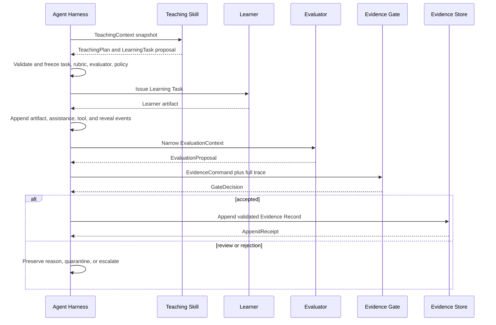

# Teaching Skill evaluator system-design boundary

Date: 2026-08-01

Scope: system-design grounding for Wayfinder issue #8. This memo asks whether a Teaching Skill should contain its own evaluator or whether evaluation should be a separate versioned component and trust boundary. It addresses architecture, authority, replay, observability, failure isolation, latency, and evolutionary cost. It does not settle domain-specific rubric validity or high-stakes assessment policy.

## Decision recommendation

Separate **evaluation authority** from **instructional authority** at the interface and durable-write boundaries, but do not require a separate service for the first implementation.

The minimum defensible architecture is:

1. A Teaching Skill receives a versioned `TeachingContext` and emits typed instructional proposals and observation events.
2. A separately versioned Evaluator receives a narrower `EvaluationContext` containing the frozen learner artifact, declared task and rubric, conditions, and assistance history.
3. The Evaluator emits an `EvaluationProposal`. It has no durable-write capability.
4. The Agent Harness applies deterministic schema, permission, provenance, and evidence-contract checks through the durable-write gate.
5. Only the Harness may append a validated Evidence Record and update derived learner interpretations.

The separation is **logical and authority-bearing**, not necessarily physical. An MVP may run the Teaching Skill, Evaluator, and gate in one process and may use the same underlying Model in separate invocations. It must still isolate inputs, pin versions, freeze the evaluator before the Attempt, preserve the event trace, and prevent either component from writing canonical state.

A separate process, Model, service, human review, or multiple evaluators becomes necessary when the claim is consequential, subjective, broad, adversarial, poorly calibrated, or expensive to reverse. Physical isolation is a risk-control option. It is not the definition of the boundary.

## Why the boundary exists

This is not primarily about distrusting a Teaching Skill. It is about avoiding a component that simultaneously:

- chooses the task;
- shapes the learner's response;
- knows the desired pedagogical outcome;
- decides whether its own intervention worked;
- defines what the result means;
- writes the resulting learner claim.

That design creates an uninspectable self-certification loop. Even a well-intentioned Model can reinterpret ambiguous work in favor of the plan it just produced, leak hidden tutoring context into scoring, revise criteria after seeing the answer, or conceal how assistance affected the result.

A typed boundary makes those failures observable and replaceable. It also permits different evaluators for deterministic answers, code execution, oral explanations, open-ended reasoning, transfer tasks, and human review without rewriting the Teaching Skill.

## Established system-design principles

### 1. Separate proposals from authoritative writes

Microsoft's CQRS guidance separates commands that express business intent from queries and read models, with validation and domain logic on the write side. It also notes that logical separation can exist in one data store before systems need independent scaling or storage. The relevant Socratink analogy is not a literal application of CQRS. It is the authority split: a skill or evaluator may propose a change, while a distinct write-side gate validates whether canonical state may change. See [Microsoft, CQRS pattern](https://learn.microsoft.com/en-us/azure/architecture/patterns/cqrs).

Open Policy Agent makes a similar distinction between policy decision and policy enforcement. A policy engine returns structured decisions, while the host application remains the enforcement point. Socratink should use the same shape: Evaluators produce interpretations; the Harness enforces evidence and durable-write policy. See [Open Policy Agent documentation](https://www.openpolicyagent.org/docs/latest/).

Product consequence: an `EvaluationProposal` is not an Evidence Record, and an Evidence Record proposal is not a durable learner claim.

### 2. Preserve the evidence-critical event history

Microsoft's event-sourcing guidance describes an append-only event stream that supports auditability and historical reconstruction, but explicitly warns that event sourcing introduces substantial complexity and should be adopted only where its benefits justify the cost. See [Microsoft, Event Sourcing pattern](https://learn.microsoft.com/en-us/azure/architecture/patterns/event-sourcing).

Socratink should therefore use **scoped event sourcing**, not declare the entire product event-sourced by default. The evidence-critical path should preserve immutable events for:

- task and evaluator selection;
- task issuance;
- learner artifacts and modality conditions;
- assistance, tool, feedback, and reveal events;
- evaluator invocation and output;
- gate decision;
- accepted Evidence Record;
- later correction, dispute, supersession, or deletion.

Current learner views may be projections derived from these events. This gives the system enough history to reconstruct why a claim changed without imposing event sourcing on every product object.

### 3. Replay requires versioned orchestration and isolated nondeterminism

Temporal's workflow documentation requires deterministic workflow code for replay and moves nondeterministic operations such as API calls, database queries, and LLM invocations into separately recorded Activities. Workflow code changes require versioning because replayed commands must match prior event history. See [Temporal Workflow Definition](https://docs.temporal.io/workflow-definition).

Socratink need not adopt Temporal, but the invariant is useful:

- orchestration decisions must be reproducible from versioned inputs and recorded events;
- Model calls are nondeterministic activities whose inputs, outputs, provider, Model, parameters, prompt or policy version, and timing must be recorded;
- a historical evaluation is replayable only against its original versions or explicitly re-evaluated as a new interpretation.

Re-running a newer Evaluator over an old Attempt must create a new evaluation proposal. It must not silently rewrite the historical record.

### 4. Typed component interfaces improve containment and replacement

The WebAssembly Component Model uses explicit interfaces and enforced calling contracts between separately compiled modules. Components interact only through declared imports and exports, allowing implementation language and deployment details to vary behind the contract. See [Bytecode Alliance, Why the Component Model?](https://component-model.bytecodealliance.org/design/why-component-model.html).

Socratink does not need WebAssembly for the MVP. The system-design lesson is that a trust boundary begins with a narrow typed interface and capability set. A Teaching Skill should not receive a database handle. An Evaluator should not receive a durable-write handle. A Persona should not receive either. Future plugin sandboxing can strengthen the same interfaces without changing the domain contract.

### 5. Evaluation must be designed, logged, and calibrated

OpenAI's official evaluation guidance recommends task-specific evals, early and continuous evaluation, extensive logging, automated scoring when appropriate, and human feedback to calibrate automated metrics. It warns against generic metrics, biased datasets, vibe-based evaluation, and ignoring human judgment. It also recommends comparison, classification, or criteria-based scoring over unconstrained generation where possible. See [OpenAI, Evaluation best practices](https://platform.openai.com/docs/guides/evaluation-best-practices.md).

OpenAI's grader documentation treats a model grader as a separate model role that evaluates another output and defines grader configuration as structured data. It also demonstrates combining deterministic, similarity, code, and model-based graders. See [OpenAI, Graders](https://platform.openai.com/docs/guides/graders.md).

Product consequence: use the simplest valid evaluator first. Deterministic checks, executable tests, exact constraints, and reference comparisons should precede open-ended model judgment. Model-based evaluation must declare uncertainty and be calibrated against human or expert judgments for the intended use.

### 6. Separate focused calls can outperform one overloaded call

Anthropic's agent architecture guidance recommends simple, composable patterns and increasing complexity only when needed. It describes prompt chaining with programmatic gates, routing for separation of concerns, parallel evaluator calls for different criteria, and an evaluator-optimizer workflow where one Model call generates and another evaluates against explicit criteria. It also notes that multiple calls trade latency and cost for performance. See [Anthropic, Building effective agents](https://www.anthropic.com/engineering/building-effective-agents).

Product consequence: do not force one tutoring invocation to teach, score, police policy, and certify evidence simultaneously. A separate invocation creates a cleaner attention surface even when it uses the same Model.

### 7. End-to-end tracing must cross process boundaries

OpenTelemetry models a trace as correlated spans that can cross processes, services, machines, and data centers. Span context and trace IDs preserve the full path of one operation. See [OpenTelemetry, Traces](https://opentelemetry.io/docs/concepts/signals/traces/).

Every evidence-eligible learning interaction should have one trace identity connecting plan, task, learner artifact, assistance, evaluator, gate decision, and committed record. Physical separation must not break causal observability.

### 8. Risk management applies across the AI lifecycle

NIST's Generative AI Profile extends the AI Risk Management Framework to the design, development, use, and evaluation of generative AI systems. See [NIST AI 600-1](https://doi.org/10.6028/NIST.AI.600-1). The architectural implication for Socratink is conservative: evaluation quality, monitoring, provenance, and human accountability cannot be delegated entirely to an opaque Model invocation, especially when the resulting claim affects a learner's route or self-understanding.

## Socratink product commitments

The following are constitutional product choices, not conclusions forced by generic architecture literature:

- learner work remains distinct from Agent Actions;
- assistance conditions constrain what performance demonstrates;
- only validated Evidence Records may update learner interpretations;
- a Persona may shape presentation but not evaluation criteria or evidence scope;
- the learner may inspect, dispute, correct, export, and delete the evidence trail;
- evaluator outputs preserve uncertainty, counterevidence, and maximum claim scope;
- current learner state remains a projection over preserved evidence rather than an unexplained Model memory.

## Four deployment options

| Option | Boundary quality | Cost and latency | Appropriate use | Main failure |
| --- | --- | --- | --- | --- |
| Evaluator embedded in the same tutoring invocation | Weak | Lowest | Non-evidentiary conversational feedback only | Hidden self-certification and context leakage |
| Separate evaluator interface and invocation in the same process, possibly same Model | Strong enough for MVP when enforced | Low to moderate | Most low-stakes learning evidence | Shared implementation bugs or correlated Model bias |
| Separate Model or isolated worker process | Stronger failure and context isolation | Moderate | Subjective, adversarial, or broader claims | Added latency, cost, retries, and operational complexity |
| Independent service, multiple raters, or human review | Strongest practical oversight | Highest | High-stakes, consequential, disputed, or poorly calibrated claims | Workflow delay, reviewer inconsistency, and expense |

The correct progression is not "microservices are safer." It is:

> Preserve the logical authority boundary from day one, then increase physical and human independence when measured risk warrants it.

## Recommended interfaces

```text
TeachingSkill.plan(TeachingContext) -> TeachingSkillResult
Evaluator.evaluate(EvaluationContext) -> EvaluationProposal
EvidenceGate.validate(EvidenceCommand) -> GateDecision
EvidenceStore.append(ValidatedEvidenceEvent) -> AppendReceipt
```

### `EvaluationContext`

The Evaluator receives only what is required to apply the declared Evidence Contract:

- evaluator, rubric, interpretation-rule, target, and task versions;
- frozen learner artifact and content hash;
- modality and environmental conditions;
- allowed Tools and relevant accommodations;
- assistance, feedback, exposure, and reveal events;
- declared evidence use and maximum permissible claim;
- relevant references or executable fixtures;
- trace identity and provenance.

It should not receive:

- the Teaching Skill's hidden reasoning or desired result;
- Persona instructions unrelated to the construct;
- a request to confirm a planned learner-state update;
- mutable criteria generated after observing the response;
- unrestricted access to learner history;
- database or durable-write capabilities.

### `EvaluationProposal`

The proposal contains:

- evaluator identity, version, content hash, and execution environment;
- criterion-level observations and results;
- referenced learner-artifact spans or executable outputs;
- deterministic checks and Model judgments kept distinguishable;
- uncertainty, disagreement, counterevidence, and calibration status;
- assistance-conditioned interpretation;
- maximum claim scope;
- recommended next action;
- warnings, failures, and escalation requirements;
- complete trace and provenance references.

### `GateDecision`

The Harness may return:

- `accepted`;
- `accepted_with_narrower_scope`;
- `needs_second_evaluator`;
- `needs_human_review`;
- `quarantined`;
- `rejected_invalid_context`;
- `rejected_policy_violation`;
- `rejected_schema_or_provenance`;
- `rejected_evaluator_failure`.

Every decision preserves a reason and exact versions.

## Reference execution sequence



## Failure matrix

| Failure | Required system response |
| --- | --- |
| Teaching Skill changes rubric after seeing the response | Reject evaluation eligibility and preserve the mutation attempt. |
| Evaluator receives hidden tutor reasoning or desired score | Mark evaluation context contaminated and rerun with isolated context. |
| Same invocation both teaches and scores | Treat as formative feedback only unless a separate valid evaluation occurs. |
| Evaluator times out or crashes | Preserve the learner artifact, retry idempotently, and create no learner claim. |
| Duplicate delivery after retry | Deduplicate by evaluation invocation and artifact content IDs. |
| Evaluator version unavailable for replay | Preserve historical result; do not claim exact replay; require explicit re-evaluation under a new version. |
| Deterministic and Model graders disagree | Preserve both, narrow the claim, and escalate according to policy. |
| Two Model evaluators disagree materially | Record disagreement and require adjudication or additional evidence. |
| Persona language leaks into rubric judgment | Reject or quarantine the proposal as policy contamination. |
| Agent-generated work appears inside learner artifact | Separate spans and exclude Agent Actions from learner credit. |
| Gate service unavailable | Queue the proposal and preserve observations; do not bypass the gate. |
| Evidence append succeeds but projection update fails | Rebuild the projection from the accepted event stream. |

## MVP architecture

Start with a modular monolith:

- typed `TeachingSkill`, `Evaluator`, and `EvidenceGate` interfaces;
- separate Model invocations and prompt contexts;
- evaluator and rubric frozen before an evidence-eligible Attempt;
- deterministic checks before Model judgment;
- an append-only evidence audit stream plus ordinary relational projections;
- content-addressed artifacts and idempotency keys;
- one end-to-end trace ID;
- golden evaluation fixtures and replay tests;
- no direct canonical-state capability in Skills or Evaluators.

Do not start with separate evaluator microservices unless deployment or security constraints already require them. A network boundary introduces partial failure, retries, authentication, schema evolution, observability, and consistency costs. Logical isolation captures most immediate epistemic value while keeping the causal loop inspectable.

## Evolution triggers

Move evaluation to a separate worker, Model, service, panel, or human review when one or more are observed:

- evaluator latency or compute scales independently from tutoring;
- untrusted third-party Teaching Skills or Evaluators are installed;
- cross-tenant data isolation requires a stronger security boundary;
- correlated tutor-evaluator bias appears in calibration data;
- evaluator failures threaten the learner interaction runtime;
- claims affect credentials, admissions, employment, safety, money, or regulated decisions;
- disputes or audits require organizational independence;
- adversarial learners or content create evaluator-gaming pressure;
- domain experts are required to establish validity;
- multiple modalities need specialized evaluation infrastructure.

## Karpathy perspective

> This section uses an evidence-grounded simulation of Andrej Karpathy's public reasoning. It is not Karpathy, is not endorsed by him, and the recommendation is a framework inference.

### Documented pattern

Karpathy's `autoresearch` fixes `prepare.py`, including runtime utilities and evaluation, while the agent may modify only `train.py`. Experiments use a fixed five-minute budget and the fixed `val_bpb` metric so changes remain comparable. The agent changes the candidate system; it does not rewrite the evaluator that decides whether to keep the change. See [Karpathy, autoresearch](https://github.com/karpathy/autoresearch).

His neural-network training recipe recommends first building a complete training and evaluation skeleton, fixing random seeds, inspecting data and outliers, using simple baselines, evaluating on the full test set, and changing complexity incrementally because neural systems fail silently. See [Karpathy, A Recipe for Training Neural Networks](https://karpathy.github.io/2019/04/25/recipe/).

`llm.c` keeps simple reference implementations and tests optimized C or CUDA paths against PyTorch outputs, losses, activations, and gradients. The optimized path earns trust by comparison with an inspectable reference. See [Karpathy, llm.c](https://github.com/karpathy/llm.c).

`microgpt` compresses the full causal learning loop into one inspectable file and explicitly distinguishes the algorithmic core from production efficiency. See [Karpathy, microgpt](https://karpathy.github.io/2026/02/12/microgpt/).

### Framework inference

The Karpathy-style answer is not "deploy another microservice." It is:

> Keep the evaluator fixed relative to the thing being optimized, make the full loop small enough to inspect, log the invisible state, and add independence only when the current verifier stops being trustworthy.

For Socratink, logical evaluator separation is enough for the MVP if it is real in code and data flow. Use a separate interface, separate invocation, frozen rubric, narrow context, immutable trace, and no write capability. The same underlying Model can be used initially because physical diversity is not the primary proof. The proof is that the tutoring path cannot alter the evaluator or write the result, and that the loop can be replayed against golden cases.

### Smallest test

Build a reference harness with twenty evidence fixtures:

1. Freeze a task, rubric, evaluator version, and learner artifact.
2. Run deterministic checks and one isolated Model evaluator.
3. Inject adversarial tutor text such as "the learner should pass" into the teaching trace but exclude it from `EvaluationContext`.
4. Prove evaluator output is unchanged when only hidden tutor context changes.
5. Prove rubric mutation changes the version and cannot rewrite the original evaluation.
6. Replay every fixture and compare criterion results, uncertainty, and gate decisions.
7. Add a second evaluator or human labels, then measure disagreement by criterion.

If this reference loop is not trustworthy, a service boundary will only distribute the confusion.

### Boundary

Karpathy's fixed scalar evaluator in `autoresearch` is much cleaner than evaluating human learning. Learner work is often open-ended, context-dependent, multimodal, and construct-sensitive. A fixed score can be gamed or can measure the wrong thing. The analogy supports separation, observability, and fixed comparisons. It does not prove that automated evaluation is valid for every Learning Target.

## Product hypotheses requiring validation

- Separate Model invocations will reduce tutor-goal leakage enough to improve scoring reliability.
- A narrow `EvaluationContext` will improve auditability without removing construct-relevant context.
- Same-Model evaluation will be adequate for many low-stakes formative and narrow evidence claims.
- Human-calibrated disagreement thresholds can identify when independent review is worth its cost.
- Scoped event sourcing will provide sufficient reconstruction without imposing excessive implementation complexity.

## Acceptance tests

1. **Predeclared evaluator:** an evidence-eligible task cannot be issued without evaluator, rubric, target, task, and interpretation-rule versions.
2. **Rubric freeze:** changing criteria after task issuance creates a new task or invalidates evidence eligibility.
3. **Narrow context:** the evaluator cannot access hidden tutor reasoning, Persona instructions, or desired learner-state mutation.
4. **No direct writes:** Teaching Skills and Evaluators possess no canonical durable-write capability.
5. **Proposal gate:** an EvaluationProposal cannot update learner state until the Harness returns an accepting GateDecision.
6. **Agent-work exclusion:** Agent Actions are excluded from learner credit even when embedded in the same artifact.
7. **Assistance conditioning:** identical learner answers under different assistance histories may yield different maximum claim scopes.
8. **Idempotent retry:** evaluator timeout and retry produce at most one accepted evaluation event for the invocation ID.
9. **Historical replay:** exact versions and recorded inputs reconstruct the original orchestration and deterministic checks.
10. **Explicit re-evaluation:** applying a new evaluator version to old work appends a new interpretation without overwriting history.
11. **Deterministic-first:** executable or rule-based checks run before open-ended Model judgment when applicable.
12. **Disagreement:** material grader disagreement is preserved and triggers narrowing or escalation.
13. **Persona isolation:** changing Persona style alone cannot change rubric criteria or permissible claim scope.
14. **Trace continuity:** plan, task, attempt, assistance, evaluation, gate, and evidence append share one trace identity.
15. **Gate outage:** evidence remains pending and no component bypasses the gate.
16. **Projection recovery:** derived learner state can be rebuilt from accepted evidence events.
17. **Risk escalation:** a high-stakes or poorly calibrated claim requires the declared stronger evaluator or human-review tier.
18. **MVP topology:** all tests pass in one process before any separate service is introduced.

## Caveats and what was not checked

- This is an architecture synthesis, not an empirical comparison of tutor-evaluator deployment patterns.
- OpenAI's current Evals and grader products have published deprecation timelines. Their design guidance remains useful, but Socratink must not bind its contract to those product APIs.
- NIST AI RMF is voluntary risk-management guidance, not a software architecture specification.
- Event sourcing, CQRS, OPA, Temporal, WebAssembly components, and OpenTelemetry are design analogies. Socratink need not adopt those technologies to preserve the stated invariants.
- No commercial AI tutor's internal evaluator architecture was inspected.
- No threat model for malicious third-party skill packages was completed here.
- Exact human-review thresholds, evaluator calibration metrics, and domain-specific validity studies remain future work.
- Voice, gesture, diagram, code, and collaborative artifacts may require specialized evaluators beyond this generic interface.
