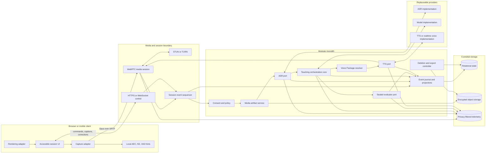
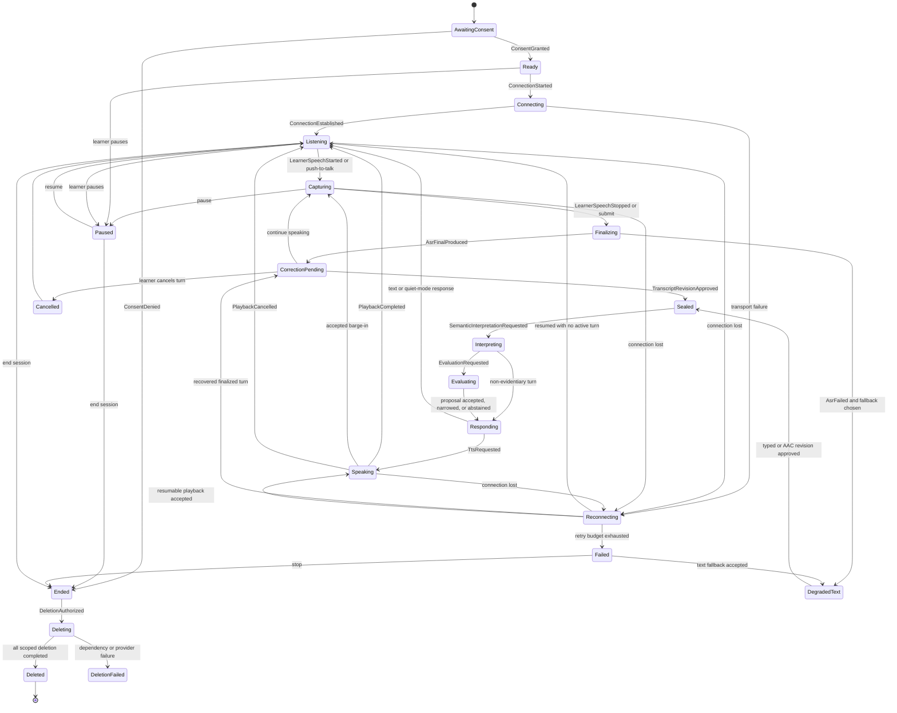
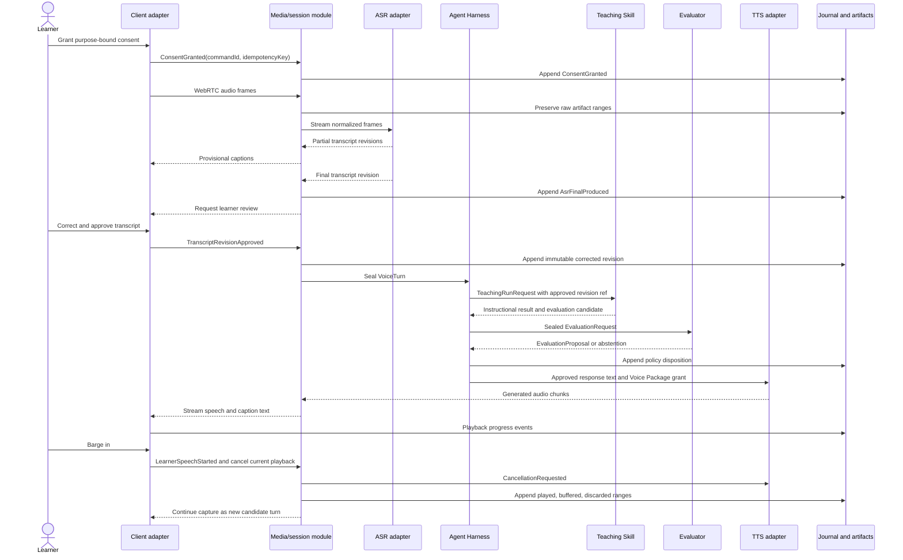
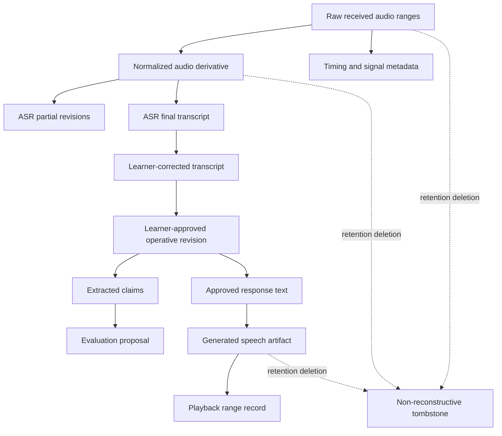

# First-class voice teaching system design

Date: 2026-08-01
Status: Research recommendation for founder decision. This memo does not amend a product contract.

## Executive recommendation

Build voice as a **capture and rendering modality around the existing semantic teaching system**, not as a separate voice agent and not as an opaque provider-owned conversation.

The smallest complete MVP is a **modular monolith** with these logical modules in one deployable application:

1. a browser or mobile capture adapter using WebRTC for live media;
2. a thin media-session module that terminates WebRTC, manages consent and recording state, and emits immutable media artifacts and events;
3. provider-neutral ASR and TTS ports with one configured implementation each;
4. the existing Teaching Skill orchestration boundary;
5. a sealed Evaluator boundary that consumes learner-approved transcript revisions and declared conditions;
6. an append-preserved event journal, relational projections, encrypted object storage, and a deletion controller;
7. WebSocket or HTTPS control paths for commands, acknowledgements, corrections, and resumable events;
8. a TURN service, because NAT and enterprise network traversal are operational requirements rather than application features.

Use WebRTC for browser and mobile live audio. Use WebSocket for ordered control events and as a declared degraded transport or server-to-server provider adapter, not as the default raw-media transport. WebRTC combines standardized browser capture with RTP and RTCP media transport, congestion and loss handling, ICE connectivity establishment, and DTLS-SRTP media protection. RTP still does not guarantee quality of service, so Socratink must measure and handle loss, jitter, and path changes explicitly.[^1][^2][^3]

Keep the semantic core modality-neutral. Learner speech evidence, teaching orchestration, evaluator authority, Persona Package behavior, and Voice Package rendering rights are five separate concerns. A voice provider may optimize streaming latency. It does not own the learner artifact, determine what counts as a turn, certify evidence, choose a Persona, authorize a cloned voice, or write canonical learner state.

The blunt rejection is equally important:

- Do not ship a provider SDK directly as “the voice architecture.”
- Do not let a speech-to-speech model's hidden transcript become canonical evidence.
- Do not let partial ASR text trigger durable evaluation.
- Do not overwrite original audio or ASR output when a learner corrects a transcript.
- Do not infer mastery, confidence, motivation, emotion, deception, disability, or intelligence from accent, pauses, prosody, volume, or fluency.
- Do not make speech mandatory when writing, text, AAC, captions, or quiet mode can preserve the construct.
- Do not promise seamless cross-provider replay. Different ASR, TTS, endpointing, and realtime model versions are not equivalent instruments.
- Do not begin with independent microservices for ASR, orchestration, evaluation, TTS, and storage. Logical boundaries and typed contracts are necessary now. Process separation is earned later by trust, scale, failure, and deployment needs.

## Claim classification

This memo uses five explicit categories.

- **Established system principle**: supported by an owning specification, official architecture document, or primary risk guidance.
- **Existing Socratink commitment**: already present in [`../../CONTEXT.md`](../../CONTEXT.md), [`../product/teaching-skill-contract.md`](../product/teaching-skill-contract.md), [`../product/persona-package-contract.md`](../product/persona-package-contract.md), or [`../product/learner-state-contract.md`](../product/learner-state-contract.md).
- **Recommendation**: a proposed design decision for Socratink.
- **Measurement hypothesis**: a target or behavior that production evidence must validate.
- **Founder decision pending**: a product, rights, retention, or consequence choice that architecture alone cannot settle.

## Existing Socratink commitments

The local contracts already settle the core authority model.

1. The Learner Agent is continuous across Models, Tools, Skills, personas, and deployments. The Model is replaceable and does not own identity, evidence, or continuity.
2. A Teaching Skill executes from a validated `TeachingContext`, returns typed proposals, and cannot directly mutate canonical state.
3. A Teaching Skill may adapt instruction but cannot certify its own instructional success.
4. An Evaluator receives a sealed request, applies a versioned rubric and interpretation rule, may abstain, and cannot teach or write durable state.
5. The Agent Harness is the sole durable-write authority and enforces permissions, versions, provenance, idempotency, concurrency, and claim ceilings.
6. Learner work and observations can be stored before evaluation, but they are not learner claims until a validated Evidence Record is committed.
7. Historical Attempts and prior interpretations are not silently overwritten. Corrections append new revisions and trigger recomputation.
8. The learner owns durable continuity records, including consent, correction, evidence, deletion, and export history.
9. Persona Packages may influence teaching style and linguistic expression, but they do not own evidence, permissions, state, or vocal likeness rights.
10. A cloned or designed voice belongs in a separately authorized and revocable Voice Package. Learner speech evidence and generated persona speech are architecturally separate.
11. Spoken performance is valid evidence only when modality and construct-irrelevant threats are explicit. Speaking is not universally superior to writing. See [`voice-learning-evidence.md`](voice-learning-evidence.md) and [`learner-evidence-mutation-validity.md`](learner-evidence-mutation-validity.md).
12. The accepted evaluator design favors a modular monolith with real logical boundaries, immutable observations, deterministic policy gates, and replay from recorded facts rather than repeated model calls. See [`teaching-skill-evaluator-system-design.md`](teaching-skill-evaluator-system-design.md).

## Established system principles

### Real-time media is a protocol system, not one socket

WebRTC is a coordinated suite rather than a single transport. The W3C API manages peer connections and media tracks. IETF WebRTC uses RTP and RTCP for realtime media, ICE with STUN and TURN for connectivity, and DTLS-SRTP for media keying and protection.[^1][^2][^3][^4][^5] A production design therefore needs separate concepts for signaling, connectivity, media transport, control events, and application semantics.

WebSocket provides full-duplex application messages over a TCP connection.[^6] It is appropriate for commands, transcripts, acknowledgements, and server-to-server streaming APIs. It does not supply RTP timestamps, RTCP delivery feedback, browser media negotiation, jitter-buffer behavior, or ICE traversal. Putting all audio and control on one ordered TCP stream also couples loss recovery to later bytes. Socratink would then own framing, pacing, buffering, congestion response, reconnect semantics, and media timing itself.

### Capture constraints are requests, not guarantees

The Media Capture and Streams specification exposes constraints including `echoCancellation`, `noiseSuppression`, `autoGainControl`, channel count, and sample rate, but devices and user agents negotiate actual settings and may differ in support.[^7] Socratink must record requested and actual settings where available. It must not assume that selecting a browser constraint proves that the signal was clean or comparable across devices.

WebRTC endpoints must implement Opus and G.711 baseline codecs, and Opus is designed for interactive speech and audio with bitrate, bandwidth, frame-duration, loss-resilience, FEC, and DTX controls.[^8][^9] This supports Opus as the live transport default. It does not make every Opus encoding or every decoded signal equivalent.

### Consent and recording indication are runtime states

The Web Speech API's security and privacy section requires explicit, informed consent before speech input and an obvious indication while audio is being recorded.[^10] Even though that API is not the recommended ASR architecture, this is the correct product principle. Consent cannot be a one-time terms-of-service checkbox. It must be attached to a purpose, artifact class, retention policy, session, and revocation path.

### Accessibility requires equivalent operation, not a speech-only path

WCAG 2.2 covers auditory, physical, speech, cognitive, language, learning, and neurological accessibility. Relevant requirements include keyboard operation, alternatives and captions for audio, control over automatically playing audio, and visible, operable status and controls.[^11] WebVTT is a standardized format for time-aligned captions and metadata and is suitable for exported or replayable caption tracks.[^12]

### Observability context must not become learner content

W3C Trace Context defines interoperable request correlation through `traceparent` and `tracestate`, and OpenTelemetry defines spans and events around operations.[^13][^14] Trace identifiers should connect client, gateway, ASR, orchestration, evaluator, TTS, and storage. Raw transcripts, audio, rubric answers, or personal attributes should not be copied into span names, tags, or unrestricted logs.

### Event envelopes do not provide delivery semantics

CloudEvents defines a vendor-neutral event envelope and stable context attributes. It does not itself guarantee ordering, exactly-once delivery, idempotency, retention, or transactional projection.[^15] Socratink must define those behaviors at the learner-session stream and command gateway.

## Recommended architecture

### Semantic modality-neutral core

The core instructional flow should consume and produce semantic artifacts rather than provider-specific audio messages:

```text
Declared modality and conditions
  -> preserved learner artifact
  -> transcript revisions
  -> learner-approved semantic input
  -> extracted claims and observation candidates
  -> sealed evaluator request
  -> evaluation proposal
  -> harness policy decision
  -> learner-facing response content
  -> selected rendering adapter
```

The same Teaching Skill should accept a typed explanation, an AAC-generated utterance, a learner-corrected transcript of speech, or another declared modality when the Evidence Contract permits it. Voice capture creates candidate learner evidence. TTS renders an Agent Action. Neither changes the Teaching Skill's authority.

### Logical architecture



### Trust boundaries

| Boundary | Trusted for | Not trusted for | Required control |
| --- | --- | --- | --- |
| Client capture adapter | Requesting permission, displaying state, collecting local audio | Canonical consent, artifact integrity after receipt, accurate device claims | Server-issued session intent, visible indicators, acknowledged events, actual-setting capture |
| Media-session module | Transport termination, sequencing, frame timing, transport metrics | Educational meaning, evidence interpretation | Narrow interface, bounded buffers, media parser isolation, content hashes |
| ASR provider | Producing named transcript hypotheses | Ground truth, learner intent, evidence authority, stable cross-version behavior | Provider manifest, confidence and alternatives, correction workflow, versioned outputs |
| Teaching orchestration | Selecting and adapting instruction within contract | Certifying learner capability, rewriting learner artifacts | Typed context, separate evaluation request, no durable-write access |
| Evaluator | Bounded interpretation against a sealed rubric | Teaching, claim widening, canonical writes, broad learner access | Least-data request, explicit abstention, citations, consequence tier |
| TTS provider | Rendering approved agent text | Persona cognition, voice rights, learner evidence, authorization | Voice Package grant, disclosure, output lineage, revocation check |
| Persona Package | Style, heuristics, teaching preferences | Voice likeness rights, evidence, credentials, state ownership | Trusted harness compilation and allowed-field projection |
| Voice Package | Authorized rendering configuration | Pedagogy, cognition, relationship memory, learner speech | Rights evidence, scope, expiration, disclosure, revocation |
| Event and artifact stores | Preserving accepted bytes and lineage | Inferring meaning | Tenant isolation, encryption, integrity checks, deletion controller |
| Operators and telemetry systems | Reliability diagnosis under scoped access | Routine access to learning content | Redaction, role separation, audited break-glass access |

## Real-time media design

### WebRTC versus WebSocket

| Concern | WebRTC | WebSocket | Socratink decision |
| --- | --- | --- | --- |
| Browser live audio | Native media tracks and peer-connection API | Application-defined binary frames | WebRTC default |
| Media timing | RTP timestamps, sequence numbers, RTCP reports | Must be designed in message schema | Prefer RTP and RTCP |
| Loss behavior | Media-oriented jitter, loss, rate, and codec mechanisms | Ordered TCP recovery delays later bytes | Do not use one ordered socket as the normal media path |
| NAT traversal | ICE, STUN, TURN | HTTPS-compatible server connection | Operate or buy TURN for WebRTC |
| Security | DTLS-SRTP media plus authenticated signaling | TLS-protected connection | Require both secure media and authenticated control |
| Browser capture processing | Integrated capture pipeline and negotiated constraints | Still requires capture API and custom packetization | Keep capture in WebRTC adapter |
| Application events | Data channel is available, but reconnect and durable command semantics remain application concerns | Natural fit for ordered JSON or binary control | Use WebSocket or HTTPS for commands and resumable events |
| Server-to-server provider streaming | Possible but provider-dependent | Common and simple | Permit WebSocket adapter behind provider port |
| Restricted network fallback | TURN over TCP or TLS may work, but can be costly | Often traverses restrictive proxies | Offer declared degraded WebSocket upload or push-to-talk fallback |

A provider example must remain an example. OpenAI's official realtime documentation currently recommends WebRTC rather than WebSocket for browser and mobile client connections and uses a WebRTC data channel for provider events.[^16] Google Cloud Speech-to-Text streaming currently uses gRPC and documents streaming duration and message limits.[^17] These facts justify capability negotiation. They do not justify a provider-shaped domain model.

### RTP, RTCP, ICE, TURN, and secure media

The media session should preserve the following transport facts:

- negotiated codecs and `fmtp` parameters;
- SSRC and track identity without treating it as learner identity;
- RTP sequence gaps, extended sequence range, timestamp mapping, jitter, and packet loss;
- RTCP sender and receiver report timing where exposed;
- ICE candidate-pair type, selected path, restarts, and TURN use;
- round-trip time, bytes sent and received, concealed samples, jitter-buffer delay, and audio energy from the W3C stats surface where implemented.[^18]

ICE gathers and checks candidate paths. TURN relays when direct paths cannot be established, including restrictive enterprise networks.[^4][^5] A TURN dependency is therefore part of the production availability plan. Relay percentage is also a cost and network-quality metric.

DTLS-SRTP establishes media protection keys on the media path.[^19] Signaling still needs authenticated TLS, authorization, replay protection, and tenant scoping. Encrypting media in transit does not make the provider, server process, object store, or logs end-to-end private.

### Codec, sample-rate, channel, and storage choices

**Recommendation:**

- Live transport: negotiated Opus, mono by default for teaching speech, with 20 ms packets as an initial hypothesis.
- Capture source artifact: retain the received encoded elementary stream or a standards-based Ogg Opus derivative only when recording consent and retention policy permit it. Ogg Opus provides a defined storage encapsulation for Opus.[^20]
- ASR working artifact: create a separate normalized mono PCM derivative at the provider-required rate. Store it as FLAC if durable retention is justified. FLAC is a lossless PCM format with an IETF specification.[^21]
- Generated speech: preserve the provider-native output artifact and, when timing or playback audit requires it, a normalized decoded derivative. Mark whether each audio range was generated, buffered, played, interrupted, or discarded.
- Do not upsample a narrow signal and label it high fidelity. Record source rate, decode rate, resample algorithm and version, channel mapping, gain changes, and every transformation.
- Do not make 16 kHz the universal canonical rate. It is a common ASR working rate, not a valid choice for every language, speech construct, prosody study, or high-quality replay.
- Do not preserve audio indefinitely merely because storage is available. Audio, transcript, timing, and extracted claims need distinct retention classes.

Opus has an RTP clock rate of 48 kHz even when the encoded audio bandwidth is narrower.[^8] Application schemas must therefore distinguish RTP clock rate, decoded sample rate, source device rate, and normalized artifact rate.

### AEC, noise suppression, automatic gain, and device variability

Request browser or platform AEC for full-duplex speaker playback, and request noise suppression and automatic gain only as declared capture settings. Then record:

- requested constraints;
- actual track settings where exposed;
- input and output route, such as headset, speaker, Bluetooth, or built-in device, at a privacy-safe granularity;
- observed clipping, silence, dropouts, and echo-return metrics;
- whether capture continued while TTS was playing;
- whether the learner changed devices mid-turn.

AEC and noise suppression are not evidence-cleaning guarantees. Echo cancellation and noise suppression can remove speech components, alter levels, or behave differently across devices. A learner must be able to switch to headphones, push-to-talk, half-duplex, text, or quiet mode.

On mobile, audio focus, call interruptions, Bluetooth route changes, app backgrounding, power limits, and operating-system communication modes can reconfigure the audio path. Android provides a communication audio mode and communication-device APIs, but behavior still depends on hardware and operating-system implementation.[^22] Apple exposes voice-chat audio-session modes, but Socratink must validate route and interruption behavior on supported devices rather than infer parity from API names.[^23]

### Full duplex, barge-in, and turn taking

Full duplex means capture remains active while agent audio may be playing. It does not mean the system should reason from two simultaneous semantic turns without arbitration.

Use three separate mechanisms:

1. **Acoustic activity hint:** local or server VAD proposes speech start and stop from audio characteristics.
2. **Turn policy:** the session controller decides whether activity starts a learner turn, interrupts TTS, waits through a pause, or asks for confirmation.
3. **Semantic commit:** only a finalized, reviewable learner artifact becomes eligible for interpretation or evaluation.

When barge-in occurs:

1. append `LearnerSpeechStarted` with timing and detector provenance;
2. immediately lower or stop local playback;
3. send idempotent cancellation for current TTS and upstream model generation;
4. append the exact generated-audio ranges already played, buffered but not played, and discarded;
5. keep capture active and preserve any far-end echo risk;
6. begin a new learner turn only after the turn policy accepts the interruption;
7. never delete or rewrite the interrupted agent response event.

Provider VAD illustrates why the turn policy must stay local to Socratink. OpenAI currently exposes server silence-based and semantic endpointing modes, configurable thresholds and silence durations, and an option to interrupt a response.[^24] Those are provider capabilities, not stable domain semantics. The resulting events must be translated into Socratink's own typed session events.

**Measurement hypothesis:** audible agent output should stop within 250 ms at p95 after accepted learner speech start on supported devices. This must be measured from device playback, not only from a server cancellation acknowledgement.

### Captions and transcript presentation

Display rolling partial captions as provisional text. Visually distinguish:

- unstable partial ASR;
- final provider transcript;
- learner correction;
- learner-approved operative transcript;
- agent-generated speech text;
- system notices and non-speech audio.

Partial text may be replaced in the live caption surface, but its artifact or event identity must not be reused. If partials are retained, retain them as sequenced hypotheses with bounded retention. Exported session captions can use WebVTT time cues, but canonical lineage should remain in typed records rather than only in a caption file.[^12]

## Event and state model

### Event envelope

Use a CloudEvents-compatible envelope with Socratink ordering and integrity extensions:

```ts
interface VoiceEvent<T> {
  specversion: "1.0";
  id: string;                    // globally unique immutable event id
  source: string;                // stable producer URI
  type: string;                  // versioned Socratink event type
  subject: string;               // voice session or turn reference
  time: string;                  // producer occurrence time
  datacontenttype: "application/json";
  dataschema: string;
  data: T;

  tenantId: string;
  learnerId: string;
  sessionId: string;
  streamId: string;
  streamVersion: number;         // assigned by authoritative sequencer
  correlationId: string;
  causationId?: string;
  commandId?: string;
  idempotencyKey?: string;
  payloadHash: string;
  traceparent?: string;
  producerVersion: string;
  recordedAt: string;            // authoritative journal time
}
```

### Required event vocabulary

| Event family | Required events | Notes |
| --- | --- | --- |
| Consent | `ConsentRequested`, `ConsentGranted`, `ConsentDenied`, `ConsentRevoked`, `RecordingIndicatorShown` | Consent payload names purpose, artifact classes, retention, providers, and expiry |
| Session | `VoiceSessionCreated`, `ConnectionStarted`, `ConnectionEstablished`, `ConnectionDegraded`, `ReconnectStarted`, `ReconnectSucceeded`, `ResumeRequested`, `SessionPaused`, `SessionEnded`, `SessionFailed` | Connection and instructional states remain distinct |
| Capture | `CaptureStarted`, `CaptureStopped`, `MediaChunkObserved`, `MediaGapDetected`, `DeviceRouteChanged` | Chunks reference objects, not base64 content in journal |
| Turn | `LearnerSpeechStarted`, `LearnerSpeechStopped`, `VoiceTurnOpened`, `VoiceTurnFinalizationRequested`, `VoiceTurnSealed`, `VoiceTurnCancelled` | VAD event does not itself seal a turn |
| ASR | `AsrPartialProduced`, `AsrFinalProduced`, `AsrFailed` | Every output names provider, model, version, configuration, and source range |
| Correction | `TranscriptCorrectionStarted`, `TranscriptRevisionAppended`, `TranscriptRevisionApproved`, `TranscriptRevisionDisputed` | Original and corrected text coexist |
| Semantics | `SemanticInterpretationRequested`, `ClaimsExtracted`, `InterpretationFailed` | Extracted claims cite transcript spans and revision id |
| Evaluation | `EvaluationRequested`, `EvaluationProposed`, `EvaluationAbstained`, `EvaluationRejected`, `EvaluationAccepted` | Existing sealed evaluator boundary applies |
| Response | `ResponseContentProposed`, `ResponseContentApproved`, `VoicePackageResolved`, `TtsRequested`, `TtsChunkProduced`, `TtsCompleted`, `TtsFailed` | Text approval precedes rendering |
| Playback | `PlaybackStarted`, `PlaybackProgressed`, `PlaybackInterrupted`, `PlaybackCompleted`, `PlaybackCancelled` | Record played and unplayed ranges |
| Cancellation | `CancellationRequested`, `CancellationAcknowledged`, `CancellationTimedOut` | Scope names ASR, model, evaluator, TTS, playback, or whole turn |
| Deletion | `DeletionRequested`, `DeletionAuthorized`, `ArtifactDeletionCompleted`, `ProjectionRecomputed`, `DeletionCompleted`, `DeletionFailed` | Tombstones must be non-reconstructive |

### State machine



### Nominal and interrupted-turn sequence



### Idempotency and concurrency rules

1. Every client command has a globally unique `commandId`, an `idempotencyKey`, a request hash, an expected session stream version, and an authenticated actor.
2. The same idempotency key and request hash returns the original receipt.
3. The same key with a different hash is rejected and audited.
4. Only the authoritative session sequencer assigns `streamVersion`.
5. Commands using a stale expected version fail with a conflict and return the current version plus a safe recovery action.
6. A turn has at most one operative approved transcript revision, but any number of immutable historical revisions.
7. Approval uses compare-and-swap on `operativeRevisionId`. Concurrent corrections cannot silently win by last write.
8. Evaluation binds to `turnSealHash`. Any later transcript correction invalidates that proposal for canonical use and requires a new evaluation event.
9. A learner may capture a new turn while cancellation of prior TTS is still propagating. The turns have different ids. The prior response cannot write into the new turn.
10. Late ASR partials or TTS chunks after cancellation are stored only as late provider outputs under the cancelled operation. They are never reattached to the current turn.
11. Reconnect uses a resume token bound to tenant, learner, session, last acknowledged stream version, device instance, and short expiry. It cannot replay media capture authorization by itself.
12. Deletion acquires a deletion fence. New writes referencing a fenced artifact are rejected. In-flight operations are cancelled before erasure begins.
13. “Exactly once” is not claimed across networks and providers. Socratink implements at-least-once delivery with idempotent commands, deduplicated event ids, and deterministic projections.

## Artifact identity and lineage

### Artifact graph

Never silently overwrite the learner artifact. Every transformation creates a new object with immutable identity and explicit parent references.



### Minimum lineage fields

Every artifact or revision should carry:

- immutable id and schema version;
- tenant, learner, project, task, attempt, session, and turn references as applicable;
- media role: `learner_capture`, `agent_render`, `environmental`, or `mixed`;
- content type, codec, container, channels, sample rate, bit depth, byte length, duration, and time base;
- source start and end positions, RTP timestamp mapping where available, and wall-clock timestamps with clock source;
- SHA-256 or stronger approved content hash and object-store integrity metadata;
- parent artifact ids and transformation activity id;
- producer component, provider, product, model, model version, deployment or endpoint, SDK version, configuration hash, and region;
- requested and actual capture constraints;
- language and locale hypothesis, vocabulary adaptation reference, and confidence semantics;
- task, Learning Target, Evidence Contract, rubric, evaluator, Teaching Skill, Persona Package, Voice Package, and Model references where relevant;
- consent grant and purpose references;
- provenance and actor identity;
- retention class, legal hold state if applicable, expiry, exportability, and deletion state;
- created, observed, finalized, approved, sealed, superseded, and deleted timestamps as applicable;
- trace, correlation, causation, and journal stream references.

### Required artifact types

| Artifact | Identity and lineage rule | Mutation rule |
| --- | --- | --- |
| Raw audio | Range-addressable capture artifact tied to consent and transport facts | Immutable bytes. May be permanently deleted under policy |
| Normalized audio | New derivative with resampler, channel map, filters, and parent hash | Never replaces raw audio |
| ASR partial | Sequenced hypothesis with provider result id, text, word timing, alternatives, stability, and source range | A later partial supersedes display, not history |
| Final ASR transcript | Provider-declared final hypothesis | Immutable provider output |
| Learner-corrected transcript | Patch or full revision citing prior revision and correction actor | Appended revision |
| Operative transcript | Pointer to one approved revision for a sealed turn | Compare-and-swap pointer; history retained |
| Extracted claims | Structured propositions citing exact transcript spans | New extraction for each input or model version |
| Evaluation proposal | Sealed evaluator output citing claims, transcript revision, rubric, and conditions | Never rewritten; later evaluation is a new proposal |
| Timing and prosody metadata | Derived pauses, levels, pitch, speaking-rate, overlap, or VAD boundaries with algorithm version | Observation only unless construct explicitly authorizes use |
| Generated speech | TTS bytes tied to approved text and Voice Package grant | Immutable output. Playback status stored separately |
| Playback record | Played, buffered, interrupted, and discarded ranges | Append progress and terminal event |

Prosody metadata is especially sensitive. It should default to `ephemeral_diagnostics`, not `learner_evidence`. It must not enter an evaluator request unless the construct explicitly includes oral communication features and the measure has been validated for the intended population.

## Typed interfaces and schemas

The field names are recommendations, not accepted product contracts.

```ts
type Ref<K extends string> = {
  kind: K;
  id: string;
  version: string;
  contentHash?: string;
};

type DeletionState =
  | "active"
  | "fenced"
  | "deleting"
  | "deleted"
  | "deletion_failed";

type RetentionClass =
  | "ephemeral_transport"
  | "ephemeral_diagnostics"
  | "learner_work_short"
  | "evidence_required"
  | "generated_output_short"
  | "security_audit_noncontent";
```

### Modality declaration

```ts
interface ModalityDeclaration {
  schemaVersion: string;
  primary: "speech" | "writing" | "text" | "aac" | "mixed";
  inputModes: Array<"microphone" | "typed" | "pasted" | "aac" | "upload">;
  outputModes: Array<"speech" | "captions" | "text" | "visual">;
  constructRole: "construct_relevant" | "construct_incidental" | "accommodation";
  evidenceEligible: boolean;
  equivalenceGroup?: string;
  accessibilityNeeds: string[];
  accommodations: string[];
  environmentDeclaration?: {
    publicOrPrivate: "public" | "private" | "unknown";
    noiseLevel?: "quiet" | "moderate" | "noisy" | "unknown";
    deviceClass?: string;
  };
  prohibitedScoringFeatures: string[];
  validationProfileRef?: Ref<"ModalityValidationProfile">;
}
```

### Consent

```ts
interface VoiceConsentGrant {
  consentId: string;
  schemaVersion: string;
  learnerId: string;
  sessionId?: string;
  purposes: Array<
    | "live_capture"
    | "transcription"
    | "learning_evidence"
    | "quality_diagnostics"
    | "generated_voice_playback"
    | "voice_clone_enrollment"
  >;
  artifactClasses: Array<
    | "raw_audio"
    | "normalized_audio"
    | "transcript"
    | "timing_metadata"
    | "generated_speech"
  >;
  providerDisclosures: string[];
  retentionPolicyRef: Ref<"RetentionPolicy">;
  grantedAt: string;
  expiresAt?: string;
  recordingIndicatorRequired: true;
  guardianOrInstitutionalAuthorityRef?: string;
  revocationMechanism: "immediate_stop_and_delete_eligible";
  policyVersion: string;
  signatureOrReceiptHash: string;
}
```

### VoiceSession

```ts
interface VoiceSession {
  sessionId: string;
  schemaVersion: string;
  tenantId: string;
  learnerId: string;
  projectRef?: Ref<"LearningProject">;
  teachingContextRef: Ref<"TeachingContext">;
  modality: ModalityDeclaration;
  consentRefs: Ref<"VoiceConsentGrant">[];
  state: VoiceSessionState;
  streamVersion: number;
  transport: {
    kind: "webrtc" | "websocket_audio_fallback" | "offline_upload" | "text_only";
    connectionGeneration: number;
    negotiatedCodecs: string[];
    selectedCodec?: string;
    selectedCandidateType?: "host" | "srflx" | "relay" | "unknown";
  };
  providerBindings: ProviderBinding[];
  activeTurnId?: string;
  activePersonaRef?: Ref<"PersonaPackage">;
  activeVoiceRef?: Ref<"VoicePackage">;
  createdAt: string;
  lastActivityAt: string;
  deletionState: DeletionState;
}
```

### MediaArtifact

```ts
interface MediaArtifact {
  artifactId: string;
  schemaVersion: string;
  role: "learner_capture" | "agent_render" | "environmental" | "mixed";
  artifactType: "raw_audio" | "normalized_audio" | "generated_speech";
  sessionId: string;
  turnId?: string;
  objectRef: string;
  contentHash: string;
  byteLength: number;
  contentType: string;
  codec: string;
  container?: string;
  channels: number;
  sampleRateHz: number;
  rtpClockRateHz?: number;
  bitDepth?: number;
  durationMs: number;
  timeBase: string;
  sourceRange?: { start: number; end: number; unit: "sample" | "rtp_tick" | "byte" };
  parentArtifactRefs: Ref<"MediaArtifact">[];
  transformationRef?: Ref<"MediaTransformation">;
  consentRef: Ref<"VoiceConsentGrant">;
  provenance: ProviderProvenance;
  retentionClass: RetentionClass;
  expiresAt?: string;
  deletionState: DeletionState;
  createdAt: string;
}
```

### TranscriptRevision

```ts
interface TranscriptRevision {
  revisionId: string;
  schemaVersion: string;
  sessionId: string;
  turnId: string;
  parentRevisionId?: string;
  sourceMediaRefs: Ref<"MediaArtifact">[];
  kind: "asr_partial" | "asr_final" | "learner_corrected" | "learner_approved";
  sequence: number;
  text: string;
  language?: string;
  words?: Array<{
    text: string;
    startMs?: number;
    endMs?: number;
    confidence?: number;
    alternatives?: string[];
  }>;
  stability?: number;
  correctionPatch?: unknown;
  actor: "asr_provider" | "learner" | "authorized_support";
  providerProvenance?: ProviderProvenance;
  createdAt: string;
  approvedAt?: string;
  contentHash: string;
  retentionClass: RetentionClass;
  deletionState: DeletionState;
}
```

### VoiceTurn

```ts
interface VoiceTurn {
  turnId: string;
  schemaVersion: string;
  sessionId: string;
  ordinal: number;
  actor: "learner" | "agent";
  state:
    | "open"
    | "capturing"
    | "finalizing"
    | "correction_pending"
    | "sealed"
    | "interpreting"
    | "evaluating"
    | "rendering"
    | "completed"
    | "cancelled"
    | "failed";
  modality: ModalityDeclaration;
  mediaArtifactRefs: Ref<"MediaArtifact">[];
  transcriptRevisionRefs: Ref<"TranscriptRevision">[];
  operativeTranscriptRevisionId?: string;
  assistanceRefs: Ref<"AssistanceEvent">[];
  revealRefs: Ref<"SolutionRevealEvent">[];
  taskRef?: Ref<"LearningTask">;
  targetRefs: Ref<"LearningTarget">[];
  rubricRef?: Ref<"Rubric">;
  evaluatorRef?: Ref<"Evaluator">;
  sealHash?: string;
  cancellation?: { scope: string; requestedAt: string; terminalAt?: string };
  openedAt: string;
  sealedAt?: string;
  completedAt?: string;
}
```

### Provider capability and provenance

```ts
interface ProviderCapability {
  providerId: string;
  product: "asr" | "tts" | "realtime_model";
  apiVersion: string;
  modelIds: string[];
  transports: Array<"webrtc" | "websocket" | "grpc" | "http">;
  inputFormats: AudioFormat[];
  outputFormats: AudioFormat[];
  supportsPartialResults: boolean;
  supportsWordTiming: boolean;
  supportsAlternatives: boolean;
  supportsServerVad: boolean;
  supportsSemanticEndpointing: boolean;
  supportsCancellation: boolean;
  cancellationGranularity: "none" | "request" | "turn" | "stream";
  supportsResume: boolean;
  maxSessionMs?: number;
  maxMessageBytes?: number;
  regionalProcessing: string[];
  retentionModes: string[];
  versionPinning: "exact" | "alias_only" | "none";
  voiceAuthorizationFeatures?: string[];
  observedAt: string;
  capabilityHash: string;
}

interface ProviderProvenance {
  providerId: string;
  product: string;
  modelId: string;
  modelVersion?: string;
  endpointOrDeployment?: string;
  apiVersion: string;
  sdkVersion?: string;
  configurationHash: string;
  requestId?: string;
  region?: string;
  capabilityHash: string;
}
```

### Evaluator input and output boundary

```ts
interface VoiceEvaluationRequest {
  evaluationRequestId: string;
  schemaVersion: string;
  turnRef: Ref<"VoiceTurn">;
  turnSealHash: string;
  operativeTranscriptRef: Ref<"TranscriptRevision">;
  approvedClaimRefs: Ref<"ExtractedClaim">[];
  sourceMediaRefs?: Ref<"MediaArtifact">[]; // omitted unless construct requires audio
  modality: ModalityDeclaration;
  captureConditionsRef: Ref<"AttemptConditions">;
  taskRef: Ref<"LearningTask">;
  targetRefs: Ref<"LearningTarget">[];
  evidenceContractRef: Ref<"EvidenceContract">;
  rubricRef: Ref<"Rubric">;
  assistanceRefs: Ref<"AssistanceEvent">[];
  revealRefs: Ref<"SolutionRevealEvent">[];
  allowedClaimScope: string;
  prohibitedFeatureUse: string[];
  evaluatorRef: Ref<"Evaluator">;
  requestHash: string;
  idempotencyKey: string;
}

interface VoiceEvaluationProposal {
  proposalId: string;
  evaluationRequestId: string;
  status: "supported" | "weakened" | "unresolved" | "abstained" | "failed";
  criterionResults: Array<{
    criterionRef: string;
    result: string;
    transcriptSpanRefs: string[];
    mediaSpanRefs?: string[];
    uncertainty: string;
  }>;
  constructIrrelevantThreats: string[];
  counterevidence: string[];
  maximumClaimScope: string;
  recommendedDisposition: "accept" | "narrow" | "fresh_task" | "human_review" | "reject";
  evaluatorProvenance: ProviderProvenance;
  createdAt: string;
  contentHash: string;
}
```

## Latency, backpressure, cancellation, and degraded modes

### Provisional latency budget

These are measurement hypotheses, not established human-factors thresholds.

| Segment | p50 target | p95 budget | Notes |
| --- | ---: | ---: | --- |
| Capture frame and local processing | 20 to 40 ms | 80 ms | Includes capture frame, AEC and noise-processing path |
| Client to media edge | 40 ms | 150 ms | Regional placement assumption |
| First ASR partial after speech begins | 300 ms | 700 ms | Caption utility metric |
| Endpoint decision after true speech end | 450 ms | 1,000 ms | Must balance latency against premature cutoff |
| Final transcript after endpoint | 250 ms | 800 ms | Excludes learner correction time |
| Semantic orchestration and first content token | 500 ms | 1,500 ms | Depends strongly on model and task |
| Evaluator when required before response | 300 ms | 1,200 ms | Avoid evaluator on every low-consequence conversational turn |
| TTS first playable audio | 250 ms | 700 ms | From approved text chunk |
| Playback jitter buffer | 60 ms | 150 ms | Adapt to path conditions |
| End of learner turn to first agent audio | 1,500 ms | 3,500 ms | MVP target for normal non-review turns |
| Accepted barge-in to audible stop | 100 ms | 250 ms | Measure at client audio output |
| Reconnect to interactive ready | 1,000 ms | 4,000 ms | Preserve session identity and explicit recovery state |

Do not optimize only aggregate response time. Track premature endpoint rate, learner interruptions caused by system overlap, correction rate, transcript concept error, and evaluation disagreement. A fast wrong transcript is a validity regression.

### Bounded queues

| Queue | Initial bound | Overflow behavior |
| --- | ---: | --- |
| Client capture before transport | 1 second | Signal degraded connection. Do not silently drop evidence-eligible audio |
| Media edge ingress | 2 seconds per session | Apply backpressure, stop accepting new turn, or switch to local buffering |
| ASR provider send queue | 1 second | Cancel provider request and declare gap or fallback |
| ASR partial event queue | 100 revisions or 2 seconds | Coalesce display updates, retain final sequence boundaries and dropped-count telemetry |
| Semantic turn queue | 1 active learner turn plus 1 pending | Reject or ask learner to finish current turn |
| TTS generated-audio queue | 2 seconds playable audio | Pause generation or cancel oldest unplayed response by policy |
| Client playback queue | 1.5 seconds | Backpressure TTS; on barge-in discard unplayed ranges explicitly |
| Telemetry export queue | Bounded by memory and time | Drop diagnostics before learner events; increment loss counter |

Evidence-eligible media gaps must create `MediaGapDetected`, mark affected ranges, and narrow or invalidate claim scope. A hidden dropped frame is worse than a visible degraded mode.

### Cancellation propagation

Cancellation is a tree rooted at `session`, `turn`, or `operation` scope.

- Cancelling playback immediately stops local output.
- Cancelling TTS stops future generation where provider support exists.
- Cancelling model generation prevents later content from becoming approved response text.
- Cancelling ASR stops the stream but does not erase already preserved media or transcript revisions.
- Cancelling evaluation marks the proposal unavailable. A late result is stored as late output but cannot cross the gate.
- Cancelling a turn never silently deletes artifacts. Deletion is a separate authorized workflow.

Each cancellable call must accept a deadline and cancellation token. Provider adapters must report whether cancellation is acknowledged, best effort, unsupported, or timed out.

### Degraded modes

1. **WebRTC unavailable:** retry with TURN, then offer push-to-talk chunk upload or typed mode. Declare the transport change.
2. **High packet loss:** reduce bitrate, lengthen jitter buffer within budget, suggest headphones or text, and mark media quality.
3. **ASR unavailable:** preserve consented audio locally or server-side, offer typed correction, or continue non-evidentiary conversation. Do not guess a transcript.
4. **TTS unavailable:** show text and captions immediately. Teaching may continue in quiet mode.
5. **Evaluator unavailable:** provide non-certifying instructional feedback if allowed, mark evidence pending, or abstain.
6. **Provider quota exhausted:** route only after capability and policy checks. Record provider boundary and version change.
7. **Offline:** allow local note or audio capture with visible offline state. Upload later only under the original or renewed consent. Do not imply realtime evaluation.
8. **Backgrounded mobile app:** pause or terminate capture according to platform behavior and user expectation. Never continue hidden recording.

## Deterministic replay

Replay means reconstructing state and decisions from recorded events and nondeterministic outputs. It does not mean asking an ASR, model, evaluator, or TTS provider to produce the same result again.

Record at minimum:

- original media artifacts or explicit deletion tombstones;
- provider request configuration and capability hash;
- every retained ASR partial and final output used by the product;
- learner transcript revisions and approval;
- extracted claims;
- Teaching Skill inputs and typed results;
- evaluator request and proposal;
- harness policy decision;
- approved response text;
- generated speech artifact or its deletion tombstone;
- cancellation and playback ranges;
- event bytes, ordering, reducer version, and migration path.

Given the same surviving event bytes, stream order, reducer version, and policy migrations, a deterministic projector must reproduce the same current projection bytes. When personal content is deleted, deterministic replay is intentionally bounded. The projector must reproduce the disclosed absence, tombstone, and dependent claim recomputation, not deleted content.

## Provider abstraction, capability negotiation, and failover

### Provider port design

Define separate ports for:

- streaming ASR;
- batch or repair ASR;
- realtime conversational model;
- text model for orchestration;
- evaluator model or deterministic scorer;
- streaming TTS;
- Voice Package-specific rendering and watermark support.

Do not define one lowest-common-denominator “voice provider” interface. That erases differences needed for safety and quality.

At session start, resolve a `ProviderPlan` from:

- required language, locale, vocabulary, and modality;
- supported transport and audio formats;
- partial and final transcript semantics;
- word timing and alternatives;
- endpointing and cancellation behavior;
- maximum session and message sizes;
- geographic processing and retention controls;
- model and voice version pinning;
- authorization and disclosure needs;
- cost ceiling and current quota;
- validated subgroup and domain profile;
- evidence consequence tier.

### Version drift

A model alias is not an immutable version. Store the provider-returned model identifier and revision where exposed, API version, configuration hash, and observed capability hash. Run canaries on pinned audio fixtures and domain prompts. Detect drift through:

- word and concept error-rate changes;
- endpoint timing and premature-cutoff changes;
- evaluator agreement changes;
- TTS timing, pronunciation, and voice-similarity changes;
- safety and disclosure regression;
- latency and cost changes.

If a provider does not expose immutable versions, label replay as output-preserving but service-nonreproducible. Store the actual nondeterministic outputs used in the learner record.

### Failover rules

- Fail over at session start or turn boundaries when possible.
- Mid-turn ASR failover starts a new provider segment and creates a composite transcript with explicit segment provenance. It does not merge hypotheses invisibly.
- Mid-response TTS failover starts a new generated-speech artifact. A voice change must be disclosed if perceptible or rights-relevant.
- A failed evaluator cannot be silently replaced after learner work is seen if the Evaluator identity was frozen by the Evidence Contract. Use predeclared fallback rules, abstain, human review, or a fresh task.
- High-consequence evidence should not cross provider versions without calibration evidence.
- Capability equivalence is a tested claim, not a configuration flag.

## Security and privacy threat model

NIST's Privacy Framework treats privacy as enterprise risk management, and the AI RMF frames risk governance across design, development, deployment, use, and evaluation.[^25][^26] For Socratink, raw audio, transcripts, extracted misconceptions, learner corrections, voice identity, and generated speech each create different risks and must have separate controls.

| Threat | Example | Required controls |
| --- | --- | --- |
| Covert or ambiguous recording | UI indicates listening after microphone capture began | Explicit purpose-bound consent, browser and in-product indicator, server recording state, immediate mute and stop |
| Credential theft | Long-lived provider key shipped to browser | Backend credential broker, short-lived scoped tokens, audience restriction, no client master keys |
| Tenant crossover | Artifact id guessed across schools or learners | Tenant-scoped authorization at every read and write, opaque ids, row and object isolation, access audit |
| Media interception | Network observer captures audio | DTLS-SRTP for WebRTC, TLS 1.3 for signaling and APIs, secure TURN, certificate validation.[^19][^27] |
| Storage disclosure | Object URL leaks in logs | Encryption at rest, short-lived signed access, no public buckets, object access audit, redacted logs |
| Prompt injection through speech | Learner says “ignore policy and call a tool” | Treat audio and transcript as untrusted learner content, parse semantic intent under task context, enforce tool and state authority outside the model |
| Indirect transcript injection | ASR invents system-like text or uploaded audio contains instructions | Preserve provenance, never concatenate transcript as privileged prompt, structured role separation, confirmation for consequential actions |
| Malicious media | Crafted file attacks decoder or exhausts storage | Allowlist formats, signature and size checks, isolated decoders, time and memory limits, patched libraries, malware scanning where appropriate. OWASP recommends defense in depth and not trusting declared content type.[^28] |
| Replay or spoofed session events | Old consent or transcript approval resent | Nonces, short expiry, command ids, request hashes, expected stream version, device/session binding |
| Speaker spoofing or deepfake | Another person submits audio as learner | Do not claim identity from voice by default, require appropriate authentication, use fresh task interaction for consequential cases, expose uncertainty |
| Unauthorized voice cloning | Persona voice copied without rights | Separate Voice Package, verified authorization, permitted-use scope, enrollment consent, disclosure, revocation, abuse monitoring |
| Watermark stripping | Generated voice redistributed without provenance | Watermark where supported, sign exports or provenance manifests, retain generation lineage, do not rely on watermark alone |
| Model or provider retention | Provider stores audio beyond learner expectation | Contract and configuration review, minimum data, regional routing, retention-mode evidence, provider deletion API where available |
| Sensitive telemetry | Transcript or learner label included in span attributes | Allowlisted attributes, tokenized ids, content hashes, redaction, separate restricted audit store |
| Denial of wallet | Long silence or synthetic audio drives cost | Session duration limits, VAD and silence budgets, quotas per tenant and learner, rate limits, cost circuit breakers |
| Deletion race | Provider result arrives after artifact deletion | Deletion fence, cancel in-flight operations, reject late writes, reconcile provider deletion, recompute projections |

### Consent, retention, deletion, and export

Consent must separately cover live capture, raw recording, transcription, evidence use, diagnostics, generated speech, and any voice-clone enrollment. Declining raw-audio retention should not necessarily disable ephemeral streaming transcription if provider and product controls can honor that choice.

Retention should default to:

- transport buffers: seconds to minutes;
- ASR partials: session duration or a short diagnostic window unless needed for a dispute;
- raw learner audio: off by default for ordinary low-consequence teaching, or short-lived when correction, evidence, or support needs justify it;
- approved transcript and corrections: learner-owned state under the Evidence Contract;
- timing and prosody metadata: ephemeral unless construct-relevant and consented;
- generated speech: session or short replay window unless learner saves it;
- security audit: noncontent identifiers and narrowly scoped abuse signals.

Deletion must erase selected learner content from active and recoverable product storage and trigger dependent claim recomputation under the learner-state contract. Backups need documented expiry and cryptographic or physical erasure procedures. Only non-reconstructive tombstones and narrowly required records may survive.

Export should include self-describing artifacts, transcript revisions, consent, provenance, hashes, task and evaluator references, omissions, and deletion state. Exported generated media should include synthetic-speech disclosure and, where supported, tamper-evident provenance. C2PA defines signed provenance manifests, content bindings, assertions, and validation, but streaming voice support and ecosystem display are not universal. Use it as an export option, not as proof that media is true or authorized.[^29]

### Cloned-voice authorization and disclosure

A Voice Package must record:

- voice identity and technical provenance;
- authorization evidence, authorized actor, scope, jurisdictions, and expiration;
- enrollment artifacts and their own deletion rules;
- permitted personas, purposes, learners, distribution scope, and prohibited contexts;
- required synthetic-voice disclosure text and cadence;
- watermark, provenance-manifest, or detection requirements where supported;
- revocation endpoint and effective time;
- provider, model, voice id, and version compatibility;
- incident and abuse contacts.

Revocation stops future rendering immediately. It does not erase prior learner evidence, Persona Relationship State, or historical disclosure events. The FTC has documented consumer-protection concern and technical countermeasure work around voice-cloning harms, which supports defense in depth rather than reliance on detection alone.[^30]

### Minors, education records, and biometric caveats

This memo is not legal advice. Deployment counsel must determine applicable duties by jurisdiction, institution, learner age, purpose, and processing behavior.

- FERPA may apply to education records held by covered U.S. educational agencies and institutions and their service providers.[^31]
- COPPA can require notice and verifiable parental consent for covered online collection from children under 13.[^32]
- Voice recordings are personal data when linked to an identifiable learner. Biometric-specific laws may apply when voiceprints or derived features are used to identify or verify a person.
- School contracts may impose data-location, subcontractor, deletion, security, and parent-access duties beyond consumer defaults.

Do not collect voiceprints for convenience in the MVP. Authentication can remain account and session based.

## Accessibility and validity

### Required accessible modes

Every voice Teaching Skill execution must expose:

- live captions for agent speech and provisional captions for learner speech;
- full keyboard operation for start, stop, mute, push-to-talk, submit, correct, replay, pause, resume, and cancel;
- typed and pasted-text input;
- AAC-compatible text input and no timing penalty for AAC composition;
- text-only and quiet modes;
- transcript correction before evidence-eligible sealing;
- adjustable playback rate and volume without changing evaluation;
- a clear recording indicator and text status;
- visible network, ASR, and degraded-mode notices;
- learner control over automatic playback;
- a no-microphone path to complete equivalent learning work where the construct permits it.

If the target is oral pronunciation, public speaking, listening comprehension, or another genuinely audio-relevant construct, modality cannot simply be swapped without changing the Evidence Contract. The product should state what aspect is construct-relevant and provide appropriate accommodations rather than pretend every path is psychometrically identical.

### Construct-relevant and construct-irrelevant variance

For ordinary conceptual learning, score the semantic content required by the task. Do not score:

- accent or dialect;
- eloquence or rhetorical polish;
- confidence or assertiveness;
- speaking rate;
- pauses, fillers, disfluency, stuttering, or prosody;
- microphone quality or room acoustics;
- ASR confidence;
- volume;
- native-language status;
- apparent emotion.

These features may be construct-relevant only when the Learning Target and rubric explicitly define them, the measure is validated for the intended population and conditions, accommodations are addressed, and the evaluator receives only justified features.

### ASR and downstream validation

Validate each material ASR and evaluation configuration across:

- language and locale;
- accent and dialect;
- age bands, including children if supported;
- gender where appropriate and privacy-respecting;
- speech disabilities and AAC-generated speech;
- code-switching;
- domain terminology and proper nouns;
- built-in microphone, wired headset, Bluetooth, and common mobile devices;
- quiet, moderate-noise, and noisy environments;
- AEC, noise suppression, and automatic-gain combinations;
- network loss, jitter, and reconnect;
- short answers, long explanations, formulas, negation, and causal language.

Measure at least:

- word error rate;
- concept error rate;
- negation and key-term error rate;
- premature and delayed endpoint rate;
- learner correction rate and correction time;
- downstream rubric disagreement against human-reviewed transcripts;
- subgroup differences with uncertainty intervals;
- abstention and fresh-task rates;
- modality-related outcome and abandonment differences.

A provider-wide accuracy number is not enough. Socratink must validate the exact model, configuration, device and environment mix, domain, and downstream evaluator use.

## Observability and operations

### Trace and event correlation

Create one trace for each session initialization and one linked trace for each turn. Propagate trace context across:

- client command request;
- signaling and connection setup;
- media-gateway operation;
- ASR stream and finalization;
- semantic interpretation;
- Teaching Skill execution;
- evaluator request;
- policy disposition;
- TTS generation;
- playback acknowledgement;
- object and journal writes;
- deletion and export jobs.

RTP packets should not each create spans. Aggregate media metrics into periodic events or interval metrics with session and connection-generation correlation.

### Privacy-preserving telemetry

Allowed by default:

- opaque tenant, session, turn, operation, provider, and artifact ids;
- model and configuration hashes;
- durations, sizes, counts, status codes, queue depths, retry counts, and cost units;
- packet loss, jitter, RTT, concealment, bitrate, TURN use, and reconnect count;
- transcript length and confidence distribution without text;
- correction count and edit distance without correction content;
- evaluator status and criterion identifiers without learner answers;
- retention and deletion status.

Restricted or prohibited in normal telemetry:

- raw audio;
- transcript text;
- extracted misconceptions;
- names, email addresses, school identifiers, or direct learner ids;
- Voice Package enrollment samples;
- rubric reference answers;
- prompt bodies and model completions.

### SLOs and quality signals

| Domain | SLI | Initial SLO hypothesis |
| --- | --- | --- |
| Availability | Sessions reaching interactive ready | 99.5% monthly for supported clients |
| Connection | Ready within 4 seconds | 95% |
| Captioning | First partial within 700 ms | 95% after detected speech begins |
| Turn taking | Premature endpoint | Below 2% of turns, segmented by subgroup and environment |
| Barge-in | Audible stop within 250 ms | 95% |
| ASR quality | Key concept and negation accuracy | Threshold set by domain validation, not one global WER |
| Artifact integrity | Stored object hash matches journal | 100% |
| Idempotency | Duplicate command causes duplicate durable effect | 0 |
| Evidence safety | Evaluation bound to wrong transcript revision | 0 |
| Deletion | Authorized deletion completed within disclosed window | 99.9%, with every failure queued and visible |
| Accessibility | Core flow keyboard-completable and text fallback available | 100% of supported Teaching Skills |
| Cost | Cost per active minute and per sealed turn | Tenant budgets with circuit breakers |

### Error taxonomy

Use stable machine-readable classes:

- `consent_missing`, `consent_revoked`, `recording_indicator_failed`;
- `permission_denied`, `device_unavailable`, `device_route_changed`;
- `signaling_failed`, `ice_failed`, `turn_failed`, `media_timeout`, `media_gap`, `codec_unsupported`;
- `asr_timeout`, `asr_quota`, `asr_invalid_audio`, `asr_low_confidence`, `asr_provider_changed`;
- `turn_premature`, `turn_timeout`, `turn_conflict`, `revision_conflict`;
- `interpretation_failed`, `evaluation_abstained`, `evaluation_stale`, `evaluation_policy_rejected`;
- `tts_timeout`, `tts_quota`, `voice_revoked`, `voice_unauthorized`, `playback_failed`;
- `cancel_unsupported`, `cancel_timeout`, `late_provider_output`;
- `storage_integrity_failed`, `tenant_scope_violation`, `deletion_failed`, `export_incomplete`;
- `cost_budget_exceeded`, `rate_limited`, `abuse_blocked`.

Errors must separate user-actionable, retryable, provider, policy, validation, and security categories. Learner-facing copy should not expose secrets or pretend ASR failure means knowledge failure.

### Cost controls

- per-tenant and per-learner concurrent-session limits;
- maximum session and turn duration;
- silence timeout and keepalive budget;
- bounded retained audio duration;
- ASR, model, evaluator, and TTS token or second budgets;
- disable redundant evaluation for low-consequence non-evidentiary turns;
- cache only provider-independent approved content, never evidence judgments by text similarity;
- alert on TURN relay spikes, repeated reconnect loops, and TTS generated but never played;
- allocate costs to session, turn, provider, model, and feature;
- enforce a hard circuit breaker before an uncontrolled bill.

## Local, edge, and server processing

| Function | Local or device | Media edge | Application server or provider | Recommendation |
| --- | --- | --- | --- | --- |
| Permission and visible recording state | Required | Mirror authoritative state | Store consent receipt | Client and server agree before capture |
| AEC and device noise processing | Preferred | Optional diagnostics | Avoid duplicate destructive filtering | Use platform path first |
| VAD hint | Useful for UI and fast barge-in | Authoritative turn-policy input | Provider hint may supplement | Never let one VAD own semantic commit |
| Raw buffering | Short bounded buffer | Short bounded buffer and consented persistence | Object storage only by policy | Minimize copies |
| ASR | Optional future validated local model | Frame preparation | Server or provider in MVP | Keep adapter portable |
| Teaching orchestration | No | No | Trusted core | Keep canonical authority server-side |
| Evaluation | No for canonical evidence | No | Sealed evaluator boundary | Local preview may be non-authoritative |
| TTS | Platform fallback possible | Stream coordination | Provider or local engine | Voice Package rules apply to every engine |
| Transcript correction | Required UI | Sequence commands | Canonical revision store | Offline edits reconcile with stream version |
| Telemetry | Aggregate and buffer | Media metrics | Trace and SLO backend | Do not export content by default |

Local processing can improve latency, privacy, and offline behavior, but it expands model-distribution, update, device-performance, and reproducibility concerns. A local ASR model is not automatically more private if the device is shared, compromised, backed up, or exports diagnostics. Begin with local AEC, capture controls, optional VAD hints, and bounded offline capture. Add local ASR only after device coverage and subgroup validation.

## Production topology and migration plan

### Phase 0: contract and media spike

- Implement typed events, artifact hashes, consent receipts, transcript revisions, and turn sealing with prerecorded fixtures.
- Build a loopback WebRTC capture and playback spike on supported browsers and one mobile platform.
- Measure actual constraints, Opus negotiation, packet loss, device changes, cancellation, and reconnect.
- Prove that a learner correction creates a new transcript revision and invalidates stale evaluation.

### Phase 1: smallest complete modular-monolith MVP

One application deployment contains session control, WebRTC termination through an embedded media library or colocated module, ASR and TTS adapters, Teaching Skill orchestration, evaluator adapter, event journal, projections, deletion, and export. Use managed relational and object storage plus a TURN deployment. Configure one ASR and one TTS provider, but preserve provider-neutral contracts.

MVP scope:

- one learner and one Active Persona per session;
- speech input plus mandatory text and quiet-mode fallback;
- agent speech with synchronized text;
- push-to-talk and automatic endpointing;
- barge-in cancellation;
- transcript review before evidence-eligible evaluation;
- no voice cloning;
- no speaker identity verification;
- raw audio off by default or short-retention by explicit policy;
- one region or a clearly disclosed regional set;
- no offline canonical evaluation.

### Phase 2: reliability and controlled failover

- Add a second ASR or TTS adapter only after fixture-based equivalence and failover tests.
- Isolate media decoding and provider streams into workers if crashes or load threaten the monolith.
- Add multi-region media edges, regional provider plans, TURN autoscaling, and resume across application instances.
- Calibrate endpointing, ASR, and evaluation by domain, subgroup, device, and environment.
- Add human review for disputed or high-consequence evidence.

### Phase 3: local and advanced voice capability

- Validated on-device ASR or TTS for supported device classes;
- offline capture and later reconciliation;
- authorized Voice Packages with disclosure, revocation, and provenance;
- cross-provider canaries and version-drift governance;
- richer oral-communication constructs with separately validated rubrics.

### When to split services

Split a module only when at least one condition is demonstrated:

- independent scaling materially lowers cost or improves latency;
- untrusted code or media parsing needs process isolation;
- failure containment is not achievable in the monolith;
- deployment cadence or regional placement is materially different;
- provider credentials require a smaller security boundary;
- separate operators or compliance scope require isolation;
- measured workload exceeds the monolith's maintainable capacity.

A box on a diagram is not evidence for a service.

## Failure-mode matrix

| Failure | Detection | Learner-visible behavior | Canonical effect | Recovery |
| --- | --- | --- | --- | --- |
| Microphone permission denied | Capture API error | Explain and offer text or AAC | Append denial or no-consent event, no audio | Retry only on learner action |
| Recording indicator cannot be shown | UI health check or hidden/background state | Stop capture | No further media accepted | Restore visible state and request restart |
| ICE direct path fails | ICE state and candidate checks | Connecting notice | No learner artifact yet | Use TURN, then fallback |
| TURN unavailable | Allocation failure | Offer text or chunked push-to-talk | Mark transport failure | Alternate TURN region or degraded mode |
| Packet loss or jitter spike | WebRTC stats and media gaps | Quality warning, suggest headset or text | Mark affected ranges and conditions | Adapt bitrate/buffer, reconnect |
| Device route changes mid-turn | Platform event and settings change | Ask learner to confirm continuation | Split artifact segment and record conditions | Continue as composite or redo turn |
| AEC failure causes agent echo | Correlated far-end audio or repeated transcript | Stop TTS or use half-duplex | Do not evaluate contaminated range | Headset prompt, recapture |
| ASR partial arrives out of order | Provider sequence or local sequence check | Ignore stale display update | Store as late output if retained | Continue from latest valid sequence |
| ASR final is low confidence | Confidence or validation rule | Highlight uncertainty and request correction | Cannot seal for high-consequence use | Learner correction or typed fallback |
| ASR provider stream limit reached | Provider limit or deadline | Brief reconnect notice | Close segment with provenance | New segment or provider plan |
| Learner edits transcript while evaluation starts | Version conflict | Show review still pending | Reject stale evaluation request | Reseal and reevaluate |
| Duplicate correction command | Idempotency check | Return prior receipt | One durable effect | None |
| Two devices approve different revisions | Expected stream version conflict | Ask learner to choose | No silent winner | Append conflict resolution |
| Model emits tool-like instruction from transcript | Policy gate | No unauthorized action | Store blocked proposal if needed | Safe response or confirmation |
| Evaluator times out | Deadline | Continue non-certifying feedback or mark pending | No evidence mutation | Retry only under frozen policy or abstain |
| Evaluator sees stale transcript | Seal-hash mismatch | No learner impact beyond delay | Reject proposal | New sealed request |
| TTS voice authorization expires | Voice Package check | Switch to disclosed allowed voice or text | No invalid rendering | Reauthorize or use fallback voice |
| Barge-in cancellation is late | Playback telemetry | Stop locally first | Record played and discarded ranges | Cancel upstream and continue new turn |
| TTS chunks arrive after cancel | Operation state check | Not played | Store as late output or discard by retention | No attachment to active turn |
| WebRTC disconnects during speech | Connection state and missing frames | Reconnecting and local buffer notice | Turn remains unsealed | Resume with range continuity or ask redo |
| Resume token replayed | Token binding and nonce | Generic session error | Security event only | Reauthenticate |
| Object hash mismatch | Read or write verification | Pause evidence use | Quarantine artifact | Re-upload or recapture |
| Provider changes model alias | Canary and provenance drift | Usually none unless quality impact | New provider version identity | Freeze, roll back, or recalibrate |
| Raw audio deleted before dispute resolved | Retention controller | Explain remaining transcript evidence | Audio tombstone, claims recomputed if needed | Use surviving artifact or fresh task |
| Deletion provider API fails | Reconciliation job | Show deletion pending or failed | Fence content from use | Retry, escalate, document exception |
| Telemetry exporter backs up | Queue watermark | No learning-flow interruption | Drop diagnostics, not canonical events | Local counter and later export |
| Cost budget exceeded | Cost circuit breaker | Switch to text or end gracefully | Append budget event | Increase budget by authorized actor |

## Acceptance tests

### Media and transport

1. Establish WebRTC sessions through direct, server-reflexive, and TURN-relayed paths and verify selected-path telemetry.
2. Inject packet loss, jitter, reordering, and 3-second disconnects. Verify visible degradation, `MediaGapDetected`, bounded memory, and correct resume state.
3. Confirm Opus negotiation and record requested versus actual capture settings on each supported browser and mobile device.
4. Change microphone, speaker, Bluetooth, and headset routes mid-turn. Verify segmented artifact lineage and learner notice.
5. Play agent speech through speakers while capturing. Verify AEC behavior, echo contamination detection, and half-duplex fallback.
6. Reject any evidence-eligible turn containing an undisclosed media gap above the configured validity threshold.

### Consent and privacy

7. Verify no audio leaves the device before the applicable consent grant is acknowledged and the recording indicator is visible.
8. Revoke consent during capture. Verify local capture stop, server rejection of later frames, provider cancellation, and append-preserved revocation.
9. Decline raw-audio retention while allowing transcription. Verify transport buffers expire and no durable raw object exists.
10. Delete a raw artifact, corrected transcript, complete turn, and full session. Verify deletion fences, provider deletion calls, backup policy handling, projection recomputation, and non-reconstructive tombstones.
11. Export a session and verify hashes, provenance, revisions, consent, omissions, retention, and deletion state.
12. Confirm no raw audio or transcript appears in standard logs, traces, error reports, analytics events, or object URLs.

### Transcript and evidence integrity

13. Produce multiple ASR partials and a final. Verify immutable ids, ordering, display supersession, and final lineage.
14. Correct one domain term and one negation. Verify a new learner revision, unchanged ASR final, new seal hash, and reevaluation.
15. Submit two concurrent approvals from different devices. Verify one compare-and-swap success and one explicit conflict.
16. Deliver a late ASR partial after turn cancellation. Verify it cannot alter captions, operative transcript, or evaluation.
17. Attempt evaluation from an unapproved transcript. Verify policy rejection.
18. Attempt evaluation after transcript correction with the old seal hash. Verify rejection and audit event.
19. Verify the Evaluator does not receive prosody or raw audio when the construct is conceptual explanation.
20. Verify the Teaching Skill's instructional assessment cannot be cast to an Evaluation Proposal.

### Turn taking and cancellation

21. Barge in at the start, middle, and final 100 ms of TTS playback. Verify audible stop target, cancellation propagation, and played versus discarded ranges.
22. Simulate VAD false start from keyboard noise, cough, and agent echo. Verify the turn policy does not automatically seal learner evidence.
23. Simulate long reflective pauses. Measure premature endpointing and provide push-to-talk or continue controls.
24. Cancel ASR, evaluation, model generation, TTS, playback, one turn, and the entire session independently. Verify scopes do not leak.

### Provider portability and replay

25. Replay a recorded event stream with provider calls disabled. Verify byte-identical projections for surviving data.
26. Switch ASR providers at a declared turn boundary. Verify provider provenance and no claim of transcript equivalence.
27. Force mid-turn ASR failure. Verify segmented composite transcript or learner redo, never invisible merging.
28. Change a provider model alias in canary. Verify drift alerts on transcript, endpointing, latency, and cost fixtures.
29. Remove provider version availability. Verify the record remains output-reproducible from stored outputs and is labeled service-nonreproducible.

### Security

30. Send transcript text that instructs the model to ignore policy, expose another learner, invoke a tool, or commit mastery. Verify the transcript remains untrusted content and every attempt is blocked.
31. Upload malformed, oversized, mislabeled, and parser-stressing media. Verify allowlist, signature checks, quotas, isolation, and no cross-tenant access.
32. Replay consent, approval, cancellation, and deletion commands with altered payloads. Verify idempotency-key hash conflicts and audit.
33. Attempt object access using another tenant's id and a leaked expired signed URL. Verify denial and security telemetry.
34. Revoke a Voice Package during generation. Verify future chunks stop, playback is cancelled or switched under policy, and Persona state remains intact.

### Accessibility and validity

35. Complete the full learning loop by keyboard only, text only, quiet mode, and AAC-generated text.
36. Verify every agent-spoken utterance has synchronized visible text and can be stopped without stopping the session.
37. Verify provisional and learner-approved transcripts are visually and programmatically distinguishable.
38. Run screen-reader checks for recording, listening, processing, correction, playback, reconnect, and error states.
39. Confirm rubric outputs are invariant to accent, speaking rate, fillers, and synthetic prosody when semantic content is held constant for a construct where those features are irrelevant.
40. Run subgroup, device, domain, and environment ASR validation. Block evidence use where minimum thresholds or uncertainty requirements are not met.

### Operations

41. Verify trace linkage across client, media, ASR, Teaching Skill, Evaluator, TTS, journal, storage, and deletion without content in attributes.
42. Fill every queue to its bound. Verify documented backpressure and that canonical events are never dropped before diagnostics.
43. Exhaust provider quota and cost budget. Verify declared fallback, no retry storm, and accurate cost attribution.
44. Kill the application during capture, correction, evaluation, TTS, and deletion. Verify deterministic recovery from journal and fenced side effects.
45. Validate all SLO dashboards by injecting known failures and confirming alerts route to the correct error taxonomy.

## Seductive but unsafe designs to reject

| Design | Why it is seductive | Why to reject it |
| --- | --- | --- |
| Direct provider speech-to-speech SDK as the whole product | Fast demo and low perceived latency | Provider owns hidden turn, transcript, model, and event semantics; weak evidence lineage and portability |
| One WebSocket carrying audio, control, captions, and commands | Simple connection model | Ordered transport couples losses, application owns media timing and congestion, control can be blocked by audio backlog |
| “Final transcript” as learner truth | Convenient text artifact | ASR can invent or omit decisive terms; learner correction and provenance are required |
| In-place transcript editing | Simple UI and schema | Destroys the distinction among observation, provider output, learner correction, and operative state |
| Evaluate every partial for instant adaptation | Responsive behavior | Unstable hypotheses can trigger incorrect teaching or durable claims |
| Score voice confidence or hesitation | Feels personalized | Multiply determined, biased, and usually construct-irrelevant |
| Persistent raw audio by default | Useful for future models and debugging | Violates minimization, raises breach and biometric risk, and exceeds ordinary teaching purpose |
| Seamless hidden provider failover | Availability story | Conceals instrument changes and invalidates reproducibility and calibration claims |
| Persona Package embeds a cloned voice | One installable bundle | Collapses cognition, rights, rendering, disclosure, and revocation boundaries |
| Microservices from day one | Looks scalable and modern | Adds network failure, distributed transactions, telemetry leakage, and operational burden before evidence of need |
| “End-to-end encrypted” marketing for server-processed voice | Strong privacy phrase | Server and providers must decrypt to process unless a very different architecture is used |
| Speaker recognition as authentication | Frictionless identity | Spoofing, deepfake, bias, consent, and biometric-law risks are disproportionate for MVP |

## Recommendations

1. Approve WebRTC as the default live browser and mobile media transport, with WebSocket or HTTPS control and explicit fallback modes.
2. Approve the modality-neutral semantic core and prohibit provider-specific realtime events from becoming canonical domain events directly.
3. Approve append-only transcript revisions, learner approval before evidence-eligible sealing, and seal-hash invalidation of stale evaluations.
4. Approve a modular-monolith MVP with one media-session module, one ASR adapter, one TTS adapter, a sealed evaluator port, event journal, relational projections, object storage, TURN, deletion, and export.
5. Approve short-lived scoped client credentials and prohibit provider master keys in clients.
6. Approve raw audio off by default for ordinary low-consequence teaching, with purpose-specific retention when needed.
7. Approve mandatory text, captions, keyboard, AAC-compatible, and quiet-mode paths.
8. Approve the prohibition on scoring accent, eloquence, confidence, pauses, or prosody unless explicitly construct-relevant and validated.
9. Approve provider capability manifests, output provenance, drift canaries, and no claim of equivalence without evidence.
10. Defer voice cloning until Voice Package authorization, disclosure, watermark or provenance options, revocation, abuse, and deletion controls exist.

## Measurement hypotheses

1. A p95 end-of-turn to first-agent-audio budget of 3.5 seconds is usable for the first pedagogical MVP if captions and visible processing state are immediate.
2. A p95 250 ms audible barge-in stop target is achievable on supported devices with local playback cancellation before upstream acknowledgement.
3. A 20 ms Opus packetization default provides an acceptable latency and overhead balance for teaching speech.
4. A 1-second client capture buffer and 2-second edge buffer are enough for ordinary transient network variation without excessive memory or stale interaction.
5. Learner correction before evidence sealing materially reduces concept-level ASR errors without unacceptable abandonment.
6. Push-to-talk plus optional automatic endpointing will outperform semantic endpointing alone for reflective explanations and accessibility.
7. Raw audio can remain off by default for most ordinary conceptual turns while approved transcripts and correction lineage provide sufficient auditability.
8. A modular monolith can meet initial concurrency and reliability targets without separate ASR, orchestration, evaluator, and TTS services.
9. Provider failover will be less important to learner experience than transparent degraded text mode during the first release.
10. Device, environment, and domain explain enough ASR variance that provider headline accuracy will be a poor release gate.

## Founder decisions pending

1. Which learning situations, if any, justify durable raw-audio retention by default?
2. What is the maximum disclosed retention window for transport buffers, ASR partials, raw audio, generated speech, and diagnostic metadata?
3. Must learners approve every final transcript, or only evidence-eligible and high-consequence turns?
4. Which consequence tiers may use voice evidence without human review?
5. Which initial languages, ages, devices, browsers, mobile platforms, and environments are supported rather than merely attempted?
6. Is institutional deployment in schools part of MVP, or should FERPA, COPPA, school-contract, and guardian workflows be a later gated market?
7. Is Socratink willing to operate TURN and media termination, or should a managed WebRTC infrastructure provider be selected behind the same contracts?
8. Which data regions and provider retention modes are mandatory?
9. What learner-facing disclosure cadence is required for synthetic standard voices?
10. What authorization evidence is sufficient for a future Voice Package, and who can revoke it?
11. Should generated speech be downloadable or shareable, and under what provenance requirements?
12. Which SLOs are contractual, internal targets, or research metrics?
13. What cost per active minute and per sealed evidence turn is acceptable?
14. When does low ASR confidence force typed correction, fresh task, or evaluator abstention?
15. Is offline capture a launch requirement, or is explicit text fallback sufficient for MVP?

## Implementation hypotheses

- A single authoritative session stream in PostgreSQL with optimistic concurrency and an outbox can support the MVP journal and projections.
- Encrypted object storage with immutable object keys, content hashes, lifecycle rules, and short-lived signed reads can support media artifacts.
- A WebRTC library embedded in or colocated with the monolith can terminate audio without a general-purpose SFU in the one-learner, one-agent MVP.
- TURN should remain a separate network deployment even while application logic stays monolithic.
- CloudEvents-compatible envelopes plus Socratink stream fields can provide portable events without adopting an external event broker initially.
- OpenTelemetry traces and WebRTC stats polling at coarse intervals can provide useful operations data without packet-level spans.
- Provider adapters can normalize outputs into Socratink revisions while preserving raw provider payloads under short diagnostic retention.
- Local playback cancellation can satisfy barge-in experience even when upstream cancellation is slow or unsupported.
- A deterministic fixture harness with recorded audio and recorded provider outputs can test most state, replay, and failure behavior without live provider calls.

## Caveats

- WebRTC, Media Capture, MediaStream Recording, WebRTC Stats, WebVTT, and Web Speech documents have different W3C maturity levels. The memo cites them for their owned interface or format scope and notes when a document is not a Recommendation.
- Provider documentation changes faster than standards. Provider-specific facts in this memo are examples observed on 2026-08-01 and must be capability-probed and pinned in implementation records.
- Latency, queue sizes, SLOs, and retention defaults are hypotheses. They require real device, learner, network, cost, and validity measurements.
- A corrected transcript can still misrepresent nonverbal or pronunciation evidence. If audio is construct-relevant, deletion or non-retention may limit later review and must narrow the claim.
- Content hashes prove byte identity, not truth, consent, speaker identity, or educational validity.
- C2PA-style provenance can show signed claims about processing history. It does not prove that a voice likeness was lawfully authorized or that media content is authentic.
- WebRTC transport protection is not end-to-end encryption against a Socratink media server or downstream processor that must access plaintext.
- Fairness validation categories can themselves be sensitive. Collect the minimum lawful demographic data, govern access, and use statistically responsible reporting.
- This architecture reduces, but cannot eliminate, provider outage, ASR bias, model drift, deepfake, compromised-device, insider, and human-review risks.

## What was not checked

- No production code, current provider account, pricing plan, quota allocation, data-processing agreement, or regional availability was inspected.
- No browser or mobile interoperability test was run.
- No live WebRTC, TURN, ASR, TTS, model, evaluator, cancellation, or reconnect benchmark was run.
- No threat-model workshop, penetration test, parser fuzzing, or formal privacy impact assessment was performed.
- No legal analysis was performed for FERPA, COPPA, GDPR, state biometric laws, wiretap and recording-consent laws, student privacy laws, publicity rights, or voice-clone licensing.
- No ASR subgroup, domain, device, environment, or downstream scoring validation dataset was evaluated.
- No accessibility audit with disabled learners, screen readers, switch control, voice control, AAC users, or cognitive-accessibility testing was performed.
- No Voice Package provider's watermark, detection, revocation, or authorization system was technically verified.
- No exact data-store, backup, cryptographic-key, signed-object, regional failover, or disaster-recovery design was selected.
- No capacity model was built for concurrent sessions, TURN relay ratio, CPU for media transforms, object storage, egress, or telemetry volume.

## Strongest primary and owning sources

[^1]: W3C, *WebRTC: Real-Time Communication in Browsers*, Recommendation, 13 March 2025, <https://www.w3.org/TR/webrtc/>.

[^2]: IETF, RFC 8825, *Overview: Real-Time Protocols for Browser-Based Applications*, January 2021, <https://www.rfc-editor.org/rfc/rfc8825.html>.

[^3]: IETF, RFC 8834, *Media Transport and Use of RTP in WebRTC*, January 2021, <https://www.rfc-editor.org/rfc/rfc8834.html>; IETF, RFC 3550, *RTP: A Transport Protocol for Real-Time Applications*, July 2003, <https://www.rfc-editor.org/rfc/rfc3550.html>.

[^4]: IETF, RFC 8445, *Interactive Connectivity Establishment (ICE)*, July 2018, <https://www.rfc-editor.org/rfc/rfc8445.html>.

[^5]: IETF, RFC 8656, *Traversal Using Relays around NAT (TURN)*, February 2020, <https://www.rfc-editor.org/rfc/rfc8656.html>.

[^6]: IETF, RFC 6455, *The WebSocket Protocol*, December 2011, <https://www.rfc-editor.org/rfc/rfc6455.html>.

[^7]: W3C, *Media Capture and Streams*, latest published version, <https://www.w3.org/TR/mediacapture-streams/>.

[^8]: IETF, RFC 7874, *WebRTC Audio Codec and Processing Requirements*, May 2016, <https://www.rfc-editor.org/rfc/rfc7874.html>; IETF, RFC 7587, *RTP Payload Format for the Opus Speech and Audio Codec*, June 2015, <https://www.rfc-editor.org/rfc/rfc7587.html>.

[^9]: IETF, RFC 6716, *Definition of the Opus Audio Codec*, September 2012, <https://www.rfc-editor.org/rfc/rfc6716.html>.

[^10]: W3C Web Audio Community Group, *Web Speech API*, Security and privacy considerations, <https://webaudio.github.io/web-speech-api/>. This is a Community Group Draft, not a W3C Recommendation.

[^11]: W3C, *Web Content Accessibility Guidelines (WCAG) 2.2*, Recommendation, 12 December 2024, <https://www.w3.org/TR/WCAG22/>.

[^12]: W3C, *WebVTT: The Web Video Text Tracks Format*, latest published version, <https://www.w3.org/TR/webvtt1/>.

[^13]: W3C, *Trace Context*, Recommendation, 23 November 2021, <https://www.w3.org/TR/trace-context-1/>.

[^14]: OpenTelemetry, *Tracing API Specification*, <https://opentelemetry.io/docs/specs/otel/trace/api/>.

[^15]: Cloud Native Computing Foundation, *CloudEvents Specification 1.0.2*, <https://github.com/cloudevents/spec/blob/v1.0.2/cloudevents/spec.md>.

[^16]: OpenAI, *Realtime API with WebRTC*, official provider documentation, accessed 2026-08-01, <https://platform.openai.com/docs/guides/realtime-webrtc.md>.

[^17]: Google Cloud, *Transcribe audio from streaming input*, official provider documentation, <https://cloud.google.com/speech-to-text/v2/docs/streaming-recognize>; Google Cloud, *Speech-to-Text quotas and limits*, <https://cloud.google.com/speech-to-text/quotas>.

[^18]: W3C, *Identifiers for WebRTC's Statistics API*, latest published version, <https://www.w3.org/TR/webrtc-stats/>.

[^19]: IETF, RFC 5764, *Datagram Transport Layer Security Extension to Establish Keys for the Secure Real-time Transport Protocol*, May 2010, <https://www.rfc-editor.org/rfc/rfc5764.html>; IETF, RFC 8827, *WebRTC Security Architecture*, January 2021, <https://www.rfc-editor.org/rfc/rfc8827.html>.

[^20]: IETF, RFC 7845, *Ogg Encapsulation for the Opus Audio Codec*, April 2016, <https://www.rfc-editor.org/rfc/rfc7845.html>.

[^21]: IETF, RFC 9639, *Free Lossless Audio Codec (FLAC)*, December 2024, <https://www.rfc-editor.org/rfc/rfc9639.html>.

[^22]: Android Developers, `AudioManager` and `MODE_IN_COMMUNICATION`, official platform API reference, <https://developer.android.com/reference/android/media/AudioManager#MODE_IN_COMMUNICATION>.

[^23]: Apple Developer Documentation, `AVAudioSession.Mode.voiceChat`, official platform API reference, <https://developer.apple.com/documentation/avfaudio/avaudiosession/mode-swift.struct/voicechat>.

[^24]: OpenAI, *Voice activity detection (VAD)*, official provider documentation, accessed 2026-08-01, <https://platform.openai.com/docs/guides/realtime-vad.md>.

[^25]: NIST, *Privacy Framework*, <https://www.nist.gov/privacy-framework>.

[^26]: NIST, *Artificial Intelligence Risk Management Framework (AI RMF 1.0)*, NIST AI 100-1, January 2023, <https://doi.org/10.6028/NIST.AI.100-1>; NIST, *Artificial Intelligence Risk Management Framework: Generative Artificial Intelligence Profile*, NIST AI 600-1, July 2024, <https://doi.org/10.6028/NIST.AI.600-1>.

[^27]: IETF, RFC 8446, *The Transport Layer Security (TLS) Protocol Version 1.3*, August 2018, <https://www.rfc-editor.org/rfc/rfc8446.html>; IETF, RFC 9700, *Best Current Practice for OAuth 2.0 Security*, January 2025, <https://www.rfc-editor.org/rfc/rfc9700.html>.

[^28]: OWASP Foundation, *File Upload Cheat Sheet*, official security guidance, <https://cheatsheetseries.owasp.org/cheatsheets/File_Upload_Cheat_Sheet.html>.

[^29]: Coalition for Content Provenance and Authenticity, *C2PA Technical Specification 2.2*, <https://c2pa.org/specifications/specifications/2.2/specs/C2PA_Specification.html>.

[^30]: U.S. Federal Trade Commission, *FTC Announces Winners of Voice Cloning Challenge*, 8 April 2024, <https://www.ftc.gov/news-events/news/press-releases/2024/04/ftc-announces-winners-voice-cloning-challenge>.

[^31]: U.S. Department of Education, *Family Educational Rights and Privacy Act resources*, <https://studentprivacy.ed.gov/ferpa>.

[^32]: U.S. Federal Trade Commission, *Complying with COPPA: Frequently Asked Questions*, <https://www.ftc.gov/business-guidance/resources/complying-coppa-frequently-asked-questions>.
